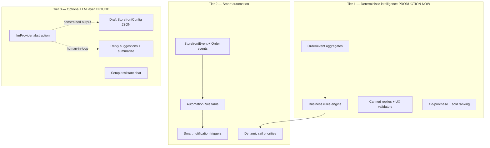

# AI Commerce Platform + Automation Evolution — Architecture

> **Principle:** Intelligent commerce through **rules + data + optional LLM** — not gimmick AI.  
> **Merchant feeling:** «Платформа помогает продавать» — not «я всё делаю вручную».

---

## 1. Current state audit

### What exists (foundation)

| Layer | Status | Paths |
|-------|--------|-------|
| Storefront builder API | Backend ready, UI partial | `GET/PUT /api/merchant/storefront-builder/*`, `AdminDesignPage` |
| UX validation | Rule-based contrast/CTA | `src/ux/validators.ts`, `validateUx()` |
| Discovery feed | Client heuristics | `discoveryFeedRegistry.ts`, `unifiedFeed.ts` |
| Analytics + events | Server metrics | `merchantAnalyticsService`, `StorefrontEvent` |
| Notifications | Schema + ORDER_NEW only | `MerchantNotification`, `AdminNotificationBell` |
| Support | Full tickets, no suggestions | `supportRoutes.ts`, `AdminSupportPage` |
| Onboarding | Manual wizard | `PlatformPage`, `MerchantRegisterPage` |
| Templates | Business-type seeds | `applyBusinessTemplate.ts`, `src/templates/` |

### What does NOT exist

| Capability | Gap |
|------------|-----|
| LLM / OpenAI | No dependency, no inference endpoints |
| Automation engine | No `AutomationRule`, no event subscribers |
| Server recommendations | No co-purchase, no API |
| Smart insights | Analytics = numbers only |
| AI builder | Manual `AdminDesignPage` only |
| Support suggestions | Free-text only |
| Actionable alerts | 6/7 notification kinds unused |
| Growth score | No merchant quality checklist |
| Campaign system | No scheduled campaigns |
| Queue / async jobs | All sync in Express handlers |

---

## 2. Intelligence architecture (3 tiers)



**Rule:** Tier 3 never bypasses Tier 1 validation (`StorefrontConfigSchema`, `validateUx`, merchant approve).

---

## 3. Automation map

### Event sources

| Event | Source | Today |
|-------|--------|-------|
| `STORE_VIEW` | Storefront | ✅ ingested |
| `PRODUCT_VIEW` | ProductCard | ✅ |
| `ADD_TO_CART` | ProductCard | ✅ |
| `CHECKOUT_START` | CheckoutPage | ✅ |
| `ORDER_CREATED` | POST /orders | ✅ (no automation) |
| `ORDER_STATUS_CHANGED` | PUT /orders | ❌ not emitted |
| `SUPPORT_TICKET_OPEN` | supportRoutes | ❌ |
| `SUPPORT_CUSTOMER_MESSAGE` | supportRoutes | ❌ |
| `CHECKOUT_ABANDONED` | inferred from CHECKOUT_START − order | ❌ Phase 2 |
| `LOW_STOCK` | product stock threshold | ❌ Phase 2 |
| `CONVERSION_DROP` | analytics compare windows | ❌ Phase 1 rules |

### Action targets

| Action | Target |
|--------|--------|
| `NOTIFY_MERCHANT` | `MerchantNotification` |
| `NOTIFY_CUSTOMER` | Telegram (existing) |
| `SUGGEST_REPLY` | Support UI chips |
| `PRIORITIZE_RAIL` | Discovery feed weights |
| `CREATE_CAMPAIGN` | Future `Campaign` model |
| `DRAFT_STOREFRONT` | `storefrontDraftConfig` (AI Tier 3) |

### Built-in automations (Phase 1–2)

| ID | Trigger | Action | Human-first |
|----|---------|--------|-------------|
| `order_new_notify` | Order created | In-app + Telegram | ✅ |
| `support_customer_msg` | Customer reply | In-app SUPPORT_TICKET | ✅ |
| `conversion_low_alert` | conversion &lt; 2% + visitors &gt; 20 | SYSTEM notification | ✅ |
| `open_tickets_alert` | pendingMerchant &gt; 3 | SYSTEM notification | ✅ |
| `checkout_abandon_nudge` | CHECKOUT_START, no order 1h | Future customer TG | Phase 2 |

---

## 4. AI integration strategy (non-gimmick)

### Phase A — No LLM (current PR direction)

- **Smart analytics insights** — rule-based from `merchantInsightsService`
- **Co-purchase recommendations** — SQL on `OrderItem`
- **Support suggested replies** — templates by ticket type + order phase
- **Merchant growth score** — checklist from business state
- **Design intelligence** — extend existing `validateUx()`

### Phase B — LLM optional (`LLM_PROVIDER` env)

| Use case | Input | Output constraint | Human gate |
|----------|-------|-------------------|------------|
| Storefront draft | businessType, name, catalog sample | `StorefrontConfigSchema` JSON | Merchant publish |
| Product descriptions | name, attributes | plain text, max 500 chars | Merchant edit |
| Support suggest | ticket thread + order | 3 reply options | Merchant sends |
| Onboarding help | missing steps list | contextual tips | UI only |

**Provider interface:** `src/server/intelligence/llmProvider.ts`

```typescript
interface LlmProvider {
  complete(params: { system: string; user: string; maxTokens: number }): Promise<string | null>;
}
// Default: nullProvider (returns null → fall back to templates)
```

**Never:** auto-send support replies, auto-publish storefront, auto-change prices.

---

## 5. Recommendations engine design

### Signals (priority order)

1. **Co-purchase** — products in same paid order (server)
2. **Sold / trending** — existing `sold` metric
3. **Category affinity** — session + server events
4. **Merchant pinned** — future `featureFlags.pinnedProducts`
5. **LLM similarity** — Tier 3 optional

### Rails

| Rail ID | Source |
|---------|--------|
| `bought_together` | `recommendationsService.getCoPurchase` |
| `trending` | catalog sold desc |
| `recent` | session |
| `related` | category + co-purchase blend |

### API

- `GET /api/storefront/recommendations?productId=&limit=8` — public, tenant header

---

## 6. Smart analytics → insights

Insight types (rule-based):

| Code | Condition | Severity |
|------|-----------|----------|
| `conversion.low` | rate &lt; 2% && visitors ≥ 20 | warning |
| `conversion.good` | rate ≥ 8% | success |
| `revenue.drop` | range revenue &lt; 50% prev period | warning |
| `support.backlog` | pendingMerchant ≥ 3 | warning |
| `catalog.thin` | products &lt; 5 | info |
| `onboarding.incomplete` | no finik / no products / no publish | info |
| `product.weak` | 0 sales in range, listed | info |

Delivered via `GET /merchant/intelligence/insights` + **Insights** tab in Operations UI.

---

## 7. Merchant growth system

**Growth score 0–100** from weighted checklist:

| Item | Weight |
|------|--------|
| Storefront published | 20 |
| ≥5 products | 15 |
| Finik configured | 15 |
| Categories set | 10 |
| Hero/banner configured | 10 |
| First order | 15 |
| Support response &lt; 24h avg | 10 |
| Analytics viewed (event) | 5 |

**Recommendations:** next 3 actions from lowest checklist items.

---

## 8. Scalability analysis

| Concern | Today | Phase 2+ |
|---------|-------|----------|
| Analytics | Loads all orders per request | Materialized daily aggregates |
| Events ingest | Sync `createMany` | Batch queue (Redis/BullMQ) |
| Notifications | Sync insert | Dedupe + digest job |
| Recommendations | On-demand SQL | Nightly co-purchase matrix cache |
| Automation | Inline in handlers | Worker + `AutomationRule` table |
| LLM calls | N/A | Rate limit, cache, async |

**Express handler rule:** ingest + notify = fire-and-forget (`void`), never block checkout.

---

## 9. Phased roadmap

### Phase 0 — Architecture ✅ (this document)

### Phase 1 — Deterministic intelligence (current)

- [ ] `merchantInsightsService` + Insights API + UI tab
- [ ] `recommendationsService` (co-purchase) + storefront rail
- [ ] `supportSuggestionService` + admin quick replies
- [ ] `merchantGrowthService` + merchant checklist UI
- [ ] Smart alert notifications (conversion, support backlog)
- [ ] Support → `SUPPORT_TICKET` notification on customer message
- [ ] `AutomationRule` schema (foundation)
- [ ] `llmProvider` stub (null provider)

### Phase 2 — Automation + campaigns

- Automation runner (cron + event hooks)
- Checkout abandon detection
- Low stock alerts
- Campaign model (scheduled banner/promo)
- Automation dashboard UI

### Phase 3 — LLM-assisted (optional env)

- Builder draft generation
- Onboarding assistant chat
- Support reply suggestions (3 options)
- Product description assist

### Phase 4 — Adaptive storefront

- Dynamic rail weights from analytics
- Seasonal preset switching
- A/B hero variants (feature flag)

### Phase 5 — Social commerce

- Reviews schema + moderation
- Share links + social proof blocks

---

## 10. File index (planned)

| Concern | Path |
|---------|------|
| Insights | `src/server/merchantInsightsService.ts` |
| Recommendations | `src/server/recommendationsService.ts` |
| Support suggestions | `src/server/supportSuggestionService.ts` |
| Growth score | `src/server/merchantGrowthService.ts` |
| Smart alerts | `src/server/smartAlertsService.ts` |
| LLM stub | `src/server/intelligence/llmProvider.ts` |
| Automation schema | `prisma/schema.prisma` → `AutomationRule` |
| Ops UI insights | `AdminAnalyticsPage.tsx` tab |
| Support UI | `AdminSupportPage.tsx` chips |

---

## 11. Non-goals (this phase)

- Auto-reply bots replacing humans
- Random ChatGPT widgets
- Full campaign scheduler UI
- Influencer / community features
- Real-time ML ranking

These belong to Phases 2–5 with explicit product design.
