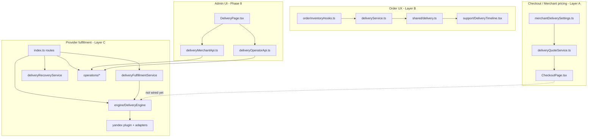
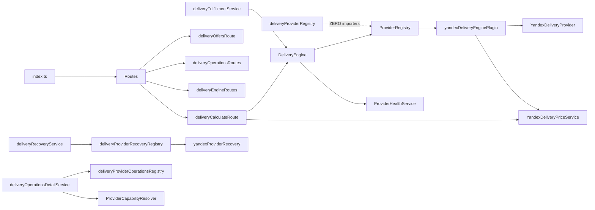

# Delivery Legacy Cleanup Audit

**Date:** 2026-06-10  
**Scope:** Phases 1–8 (Yandex integration → Multi-provider engine → Merchant Delivery UI)  
**Method:** Static import graph, route wiring in `src/server/index.ts`, frontend reference scan, Prisma schema review. **No code was modified.**

---

## Executive summary

The delivery stack is **not a single layer** — it combines three parallel concerns that must not be conflated when cleaning up:

| Layer | Purpose | Key modules |
|-------|---------|-------------|
| **A. Merchant pricing** | Checkout fee (zones, tiers, pickup) | `merchantDeliverySettings.ts`, `deliveryQuoteService.ts`, `CheckoutPage` |
| **B. Order UX timeline** | Customer-facing stages on `Order` | `deliveryService.ts`, `shared/delivery.ts`, `support/DeliveryTimeline.tsx` |
| **C. Provider fulfillment** | Yandex / multi-provider claims, tracking, ops | `src/server/delivery/**`, Phase 8 admin UI |

**True dead code found:** 3 items safe to delete with zero runtime impact.  
**Deprecated but referenced:** 4 registry/health patterns superseded by Phase 7 engine but still partially wired.  
**Unsafe to delete:** All Prisma models, Yandex plugin chain, operations platform, Phase 8 UI, and pre-phase merchant checkout pricing.

**Deployment note:** At audit time, `src/server/delivery/` and most Phase 1–8 artifacts are **untracked in git** (`??`). Only wiring files are modified (`index.ts`, `schema.prisma`, admin routes). Ensure the full tree is committed before deployment.

**Phase 8.5 update:** Checkout server quotes now use `resolveHybridCheckoutDelivery` (Delivery Engine + merchant fallback) instead of `deliveryQuoteService.resolveCheckoutDeliveryQuote`. Layer A `deliveryQuoteService` is deprecated but retained; `computeDeliveryQuote` in shared settings remains the merchant fallback pricer.

---

## Classification legend

| Status | Meaning |
|--------|---------|
| **Still used** | Imported and required at runtime |
| **Deprecated but referenced** | Superseded pattern; still imported or routed |
| **Completely unused** | No imports; safe to remove after verification |
| **Safe to delete** | Unused + no route/schema coupling |
| **Unsafe to delete** | Breaking change if removed without migration |

---

## Dependency graph (high level)

---

## Import graph (provider layer)

---

## API routes inventory

| Route | Module | Status | Notes |
|-------|--------|--------|-------|
| `POST /api/delivery/calculate` | `deliveryCalculateRoute.ts` | **Still used** | Engine path default; **no frontend caller** yet |
| `GET /api/delivery/offers` | `deliveryOffersRoute.ts` | **Deprecated but referenced** | Debug/admin; bypasses engine; direct Yandex adapter |
| `GET /api/delivery/health` | `deliveryHealthRoute.ts` | **Deprecated but referenced** | Yandex-centric; superseded by `/api/delivery/providers` health |
| `GET /api/delivery/providers` | `deliveryEngineRoutes.ts` | **Still used** | Phase 7 public provider list |
| `GET /api/delivery/:orderId/tracking` | `deliveryTrackingRoute.ts` | **Still used** | Customer + merchant tracking |
| `GET /api/delivery/:orderId/events` | `deliveryOperationsRoutes.ts` | **Still used** | Customer timeline UI |
| `POST .../yandex/webhook` | `deliveryYandexWebhookRoute.ts` | **Still used** | Provider-specific; keep until multi-webhook router |
| `GET /api/merchant/delivery/*` | ops + engine routes | **Still used** | Phase 6 + 7 + 8 UI |
| `GET /api/operator/delivery/*` | ops + engine routes | **Still used** | Phase 6 + 8 operator UI |
| Checkout `resolveCheckoutDeliveryQuote` | `index.ts` (inline) | **Still used** | Layer A; not provider API |

---

## Dead code

| Item | Classification | Evidence |
|------|----------------|----------|
| `providers/deliveryProviderRegistry.ts` | **Completely unused / Safe to delete** | `getDeliveryProvider`, `listDeliveryFulfillmentProviders` have **zero** importers outside the file |
| `patchOrderDeliveryStage()` in `deliveryService.ts` | **Completely unused / Safe to delete** | Exported but never called |
| `listProviderOperations()` in `deliveryProviderOperationsRegistry.ts` | **Completely unused** | Exported; only `getProviderPortalUrl` is used |
| `frontend/.../MerchantDeliverySettingsPanel.tsx` | **Completely unused / Safe to delete** | Zero imports; duplicate of `MerchantSettingsDeliveryPanel` |

---

## Duplicate logic

### 1. Provider registries (three + engine)

| Registry | Used? | Replacement |
|----------|-------|-------------|
| `engine/ProviderRegistry.ts` | Yes | Canonical plugin registry (Phase 7) |
| `providers/deliveryProviderRegistry.ts` | **No** | Thin wrapper over engine; **orphan** |
| `providers/deliveryProviderRecoveryRegistry.ts` | Yes | Hardcoded `yandex` only; should become plugin hook |
| `providers/deliveryProviderOperationsRegistry.ts` | Yes | Hardcoded `yandex` portal URL; should become plugin capability |

### 2. Health services

| Module | Endpoint / consumer | Overlap |
|--------|---------------------|---------|
| `services/deliveryHealthService.ts` | `GET /api/delivery/health` | Yandex config, recovery queue, metrics |
| `engine/ProviderHealthService.ts` | `/api/delivery/providers`, scoring | Per-provider in-memory metrics |

Both are active. Consolidation would merge ops health into engine provider health.

### 3. Price calculation paths

| Path | Used by | Notes |
|------|---------|-------|
| `computeDeliveryQuote` (`merchantDeliverySettings.ts`) | Checkout (client + server) | Merchant-configured fee |
| `YandexDeliveryPriceService` | Engine plugin, calculate route fallback | Provider quote |
| `DeliveryEngine.calculateBestQuote` | `POST /api/delivery/calculate` | Multi-provider selection |

Checkout does **not** call `/api/delivery/calculate` — dual pricing is intentional today but creates confusion.

### 4. Timeline / status UX (four representations)

| Representation | Consumer |
|----------------|----------|
| `Order.deliveryStage` + `shared/delivery.ts` | MyOrders, customer trust UX |
| `ProviderDelivery.status` | Ops, fulfillment, recovery |
| `DeliveryTimelineEvent` (DB) | Ops drawer, export, analytics |
| `support/DeliveryTimeline.tsx` vs `components/delivery/DeliveryTimeline.tsx` | Customer vs admin — **different components, same name** |

Not dead — parallel models. Renaming admin component recommended (Phase B).

### 5. Merchant delivery settings UI

| Component | Status |
|-----------|--------|
| `MerchantSettingsDeliveryPanel.tsx` | **Still used** (settings modal + zones) |
| `MerchantDeliverySettingsPanel.tsx` | **Duplicate, unused** |

---

## Backend file inventory (`src/server/delivery/`)

### Routes — **Still used** (all wired in `index.ts`)

| File | Classification |
|------|----------------|
| `deliveryCalculateRoute.ts` | Still used |
| `deliveryOffersRoute.ts` | Deprecated but referenced (debug) |
| `deliveryYandexWebhookRoute.ts` | Still used |
| `deliveryTrackingRoute.ts` | Still used |
| `deliveryHealthRoute.ts` | Deprecated but referenced |
| `deliveryMerchantDashboardRoute.ts` | Still used |
| `operations/deliveryOperationsRoutes.ts` | Still used |
| `engine/deliveryEngineRoutes.ts` | Still used |
| `deliveryRouteAuth.ts` | Still used |
| `deliveryRecoveryScheduler.ts` | Still used |

### Engine (Phase 7) — **Still used / Unsafe to delete**

All files under `engine/` are imported by routes, fulfillment, or bootstrap.

### Operations (Phase 6) — **Still used / Unsafe to delete**

All files under `operations/` are active.

### Core services — **Still used**

| File | Importers |
|------|-----------|
| `services/deliveryFulfillmentService.ts` | `orderInventoryHooks.ts`, tests |
| `services/deliveryRecoveryService.ts` | `deliveryRecoveryScheduler.ts` |
| `services/DeliveryRefreshService.ts` | webhooks, manual ops, yandex recovery |
| `services/deliveryRefreshApplyService.ts` | refresh service |
| `services/deliveryStatusSyncService.ts` | refresh apply |
| `services/deliveryTrackingService.ts` | tracking route |
| `services/deliveryMerchantResolver.ts` | price service, calculate |
| `services/deliveryOfferCache.ts` | fulfillment, engine |
| `services/deliveryMerchantDashboardService.ts` | merchant dashboard route |
| `services/deliveryHealthService.ts` | health route |
| `services/deliveryEvents.ts` | refresh apply |
| `services/deliveryRecoveryConfig.ts` | recovery scheduler |
| `repositories/providerDeliveryRepository.ts` | most services |
| `utils/deliveryMetrics.ts` | health, ops, analytics |
| `utils/deliveryRecoveryLogging.ts` | recovery, health |
| `types/providerDeliveryTypes.ts` | widespread |
| `types/deliveryPriceTypes.ts` | calculate route, price service |

### Provider abstraction — mixed

| File | Classification | Notes |
|------|----------------|-------|
| `providers/deliveryProviderPort.ts` | **Still used** | Types used by engine + Yandex provider |
| `providers/deliveryProviderRegistry.ts` | **Safe to delete** | Zero importers |
| `providers/deliveryProviderRecoveryRegistry.ts` | **Deprecated but referenced** | Hardcoded yandex; used by recovery + manual ops |
| `providers/deliveryProviderRecoveryPort.ts` | **Still used** | Recovery interface |
| `providers/deliveryProviderOperationsRegistry.ts` | **Deprecated but referenced** | Hardcoded yandex portal |
| `providers/deliveryProviderOperationsPort.ts` | **Still used** | Portal interface |
| `providers/deliveryProviderRetryPolicy.ts` | **Still used** | recovery + manual ops |

### Yandex plugin — **Still used / Unsafe to delete**

Entire `providers/yandex/**` tree is active (plugin, adapters, services, webhooks, DTOs, utils).  
`YandexDeliveryProvider` is wrapped by `yandexDeliveryEnginePlugin` — not obsolete.

**Phantom paths:** Glob/index may show `yandex/yandexOffersAdapter.ts`, `yandex/yandexDeliveryConfig.ts`, `yandex/yandexOffersTypes.ts` at repo root of `yandex/` — **these do not exist on disk** (verified). Only `adapters/` and `services/` copies exist.

---

## Legacy modules outside `src/server/delivery/`

| File | Classification | Role |
|------|----------------|------|
| `src/server/deliveryService.ts` | **Still used** | `initializeOrderDelivery`, `syncDeliveryStageForOrderStatus` — Layer B |
| `src/server/deliveryQuoteService.ts` | **Still used** | Checkout server quote — Layer A |
| `src/shared/delivery.ts` | **Still used** | Customer timeline steps |
| `src/shared/merchantDeliverySettings.ts` | **Still used** | Merchant pricing config |
| `src/shared/merchantDeliveryProviderPolicy.ts` | **Still used** | Phase 7 engine policy in `Business.deliverySettings` |

### `deliveryService.ts` detail

| Export | Status |
|--------|--------|
| `initializeOrderDelivery` | **Still used** — `index.ts` order creation |
| `syncDeliveryStageForOrderStatus` | **Still used** — `orderInventoryHooks.ts` |
| `patchOrderDeliveryStage` | **Safe to delete** (function only) — never called |

---

## Frontend inventory

### Phase 8 — **Still used**

| Path | Role |
|------|------|
| `pages/admin/DeliveryPage.tsx` | Main admin UI |
| `pages/admin/DeliveryPageShell.tsx` | Lazy + permissions |
| `pages/admin/OperatorDeliveryPanel.tsx` | Platform operator embed |
| `hooks/useDeliveryAdmin.ts` | State management |
| `services/deliveryMerchantApi.ts` | Merchant APIs |
| `services/deliveryOperatorApi.ts` | Operator APIs |
| `types/deliveryAdmin.types.ts` | DTOs |
| `components/delivery/*` (17 files) | Phase 8 design system |

Wiring: `AdminApp.tsx`, `AdminLayout.tsx`, `adminHashRoute.ts`, `PlatformPage.tsx`.

### Pre-phase / parallel — **Still used**

| File | Classification | Notes |
|------|----------------|-------|
| `components/support/DeliveryTimeline.tsx` | **Still used** | `MyOrders.tsx` — customer order stages |
| `components/delivery/DeliveryTimeline.tsx` | **Still used** | Ops events — **name collision** |
| `merchantSettings/.../MerchantSettingsDeliveryPanel.tsx` | **Still used** | Pricing + zones in settings modal |
| `platform/MerchantDeliverySettingsPanel.tsx` | **Safe to delete** | Duplicate, never imported |
| `CheckoutPage.tsx` | **Still used** | Layer A pricing only |
| `AdminOrdersPage.tsx` | **Still used** | Delivery address block (not provider ops) |

### APIs not consumed by frontend

| API | Status |
|-----|--------|
| `GET /api/delivery/health` | No frontend consumer |
| `GET /api/delivery/offers` | No frontend consumer (debug tool) |
| `POST /api/delivery/calculate` | No storefront consumer yet |

---

## Prisma models

| Model / enum | Classification | Notes |
|--------------|----------------|-------|
| `ProviderDelivery` | **Unsafe to delete** | Core fulfillment record |
| `ProviderDeliveryStatusEvent` | **Unsafe to delete** | Webhook audit trail |
| `DeliveryTimelineEvent` | **Unsafe to delete** | Phase 6 ops timeline |
| `DeliveryAuditLog` | **Unsafe to delete** | Phase 6 audit |
| `ProviderDeliveryStatus` enum | **Unsafe to delete** | |
| `DeliveryTimelineKind` enum | **Unsafe to delete** | |
| `DeliveryAuditActor` enum | **Unsafe to delete** | |
| `Order.deliveryMode` | **Unsafe to delete** | Pickup vs delivery |
| `Order.deliveryStage` | **Unsafe to delete** | Layer B customer UX |
| `Order.estimatedDeliveryAt` | **Unsafe to delete** | ETA display |
| `Order.preparationMinutes` | **Unsafe to delete** | |
| `Business.deliverySettings` JSON | **Unsafe to delete** | Holds pricing + `providerPolicy` |

**No obsolete Prisma models identified.** All migrations through `20260710120000_delivery_operations_phase6` are required.

---

## Environment variables

### Active — **must remain**

| Variable | Used by |
|----------|---------|
| `YANDEX_DELIVERY_OAUTH_TOKEN` (+ aliases `API_TOKEN`, `TOKEN`) | yandexDeliveryConfig |
| `YANDEX_DELIVERY_API_BASE` (+ `API_BASE_URL`) | HTTP client |
| `YANDEX_DELIVERY_USE_MOCK` | dev/test |
| `YANDEX_DELIVERY_TIMEOUT_MS` | HTTP client |
| `YANDEX_DELIVERY_HTTP_MAX_RETRIES` | HTTP client |
| `YANDEX_DELIVERY_HTTP_RETRY_BASE_MS` | HTTP client |
| `YANDEX_DELIVERY_OFFERS_PATH` | offers adapter |
| `YANDEX_DELIVERY_CLAIMS_*_PATH` | claims services |
| `YANDEX_DELIVERY_CLAIMS_ENABLED` | fulfillment gate |
| `YANDEX_DELIVERY_OFFER_CACHE_TTL_MS` | offer cache |
| `YANDEX_DELIVERY_WEBHOOK_BASE_URL` | claim create callback |
| `YANDEX_DELIVERY_WEBHOOK_SECRET` | webhook auth |
| `DELIVERY_RECOVERY_*` (6 vars) | recovery scheduler |

### Legacy aliases — **Deprecated but referenced** (Phase C)

| Alias | Canonical |
|-------|-----------|
| `YANDEX_DELIVERY_API_TOKEN` | `YANDEX_DELIVERY_OAUTH_TOKEN` |
| `YANDEX_DELIVERY_TOKEN` | `YANDEX_DELIVERY_OAUTH_TOKEN` |
| `YANDEX_DELIVERY_API_BASE_URL` | `YANDEX_DELIVERY_API_BASE` |

Do not remove alias reads until env migration is documented for ops.

### No obsolete env vars

All vars in `.env.example` delivery section are still read by `yandexDeliveryConfig.ts` or `deliveryRecoveryConfig.ts`.

---

## Deprecated modules — detailed

### 1. `deliveryProviderRegistry.ts`

| | |
|-|-|
| **Replaced by** | `engine/ProviderRegistry.ts` + `getDeliveryEnginePlugin()` |
| **Who imports it** | **Nobody** (docs only) |
| **Delete breaks?** | **No** — file is unreachable dead code |

### 2. `deliveryProviderRecoveryRegistry.ts`

| | |
|-|-|
| **Replaced by** | Engine plugin should expose `recovery` port (not implemented generically yet) |
| **Who imports it** | `deliveryRecoveryService.ts`, `deliveryManualOperationsService.ts` |
| **Delete breaks?** | **Yes** — recovery scheduler and ops retry |

### 3. `deliveryProviderOperationsRegistry.ts`

| | |
|-|-|
| **Replaced by** | Plugin `capabilities` + portal URL on `DeliveryEnginePlugin` (partial) |
| **Who imports it** | `deliveryOperationsDetailService.ts` (`getProviderPortalUrl`) |
| **Delete breaks?** | **Yes** — drawer "Open Provider" link |

### 4. `services/deliveryHealthService.ts` + `/api/delivery/health`

| | |
|-|-|
| **Replaced by** | `GET /api/delivery/providers` + `ProviderHealthService` |
| **Who imports it** | `deliveryHealthRoute.ts`; Phase 5 docs/tests |
| **Delete breaks?** | **Yes** if ops/monitoring depends on endpoint; **No** for Phase 8 UI |

### 5. `GET /api/delivery/offers`

| | |
|-|-|
| **Replaced by** | `POST /api/delivery/calculate` + engine |
| **Who imports it** | Wired in `index.ts`; manual/debug use |
| **Delete breaks?** | **Yes** for operator debug workflows documented in Phase 1 |

### 6. `MerchantDeliverySettingsPanel.tsx`

| | |
|-|-|
| **Replaced by** | `MerchantSettingsDeliveryPanel.tsx` |
| **Who imports it** | **Nobody** |
| **Delete breaks?** | **No** |

### 7. `patchOrderDeliveryStage` (export in `deliveryService.ts`)

| | |
|-|-|
| **Replaced by** | N/A — was likely admin API never shipped |
| **Who imports it** | **Nobody** |
| **Delete breaks?** | **No** |

---

## Tests inventory

| Test file | Target | Keep? |
|-----------|--------|-------|
| `deliveryEnginePhase7.test.ts` | Engine | Yes |
| `deliveryOperationsPhase6.test.ts` | Ops | Yes |
| `deliveryFulfillmentService.test.ts` | Fulfillment | Yes |
| `deliveryRecoveryService.test.ts` | Recovery | Yes |
| `deliveryRefreshService.test.ts` | Refresh | Yes |
| `deliveryHealthService.test.ts` | Legacy health | Yes until health merged |
| `deliveryMerchantDashboardService.test.ts` | Dashboard | Yes |
| `deliveryTrackingService.test.ts` | Tracking | Yes |
| `deliveryStatusSyncService.test.ts` | Status sync | Yes |
| `deliveryProviderRetryPolicy.test.ts` | Retry policy | Yes |
| `yandex*.test.ts` (7 files) | Yandex adapter | Yes |
| `merchantDeliverySettings.test.ts` | Layer A pricing | Yes |

No obsolete test files identified. Removing `deliveryProviderRegistry.ts` would not affect tests.

---

## Cleanup plan

### Phase A — Safe deletions (no migration, low risk)

1. **Delete** `src/server/delivery/providers/deliveryProviderRegistry.ts`
2. **Delete** `frontend/src/components/platform/MerchantDeliverySettingsPanel.tsx`
3. **Remove** unused export `patchOrderDeliveryStage` from `deliveryService.ts` (or entire function)
4. **Remove** unused export `listProviderOperations` from `deliveryProviderOperationsRegistry.ts` (optional hygiene)

**Pre-delete checks:** `rg deliveryProviderRegistry`, `rg MerchantDeliverySettingsPanel`, `rg patchOrderDeliveryStage`

**Estimated impact:** None on runtime.

---

### Phase B — Requires migration (medium risk)

1. **Unify provider registries**
   - Add `recoveryPort` and `portalUrl` to `DeliveryEnginePlugin`
   - Migrate `deliveryProviderRecoveryRegistry` and `deliveryProviderOperationsRegistry` to engine bootstrap
   - Update `deliveryRecoveryService` and `deliveryOperationsDetailService`

2. **Consolidate health APIs**
   - Deprecate `GET /api/delivery/health` → redirect or proxy to engine provider health
   - Merge `deliveryHealthService.ts` snapshot into `listDeliveryProvidersPublic()`
   - Update Phase 5 monitoring docs

3. **Wire checkout to provider quotes (optional product decision)**
   - Call `POST /api/delivery/calculate` from checkout when `providerPolicy.enabled`
   - Bridge merchant fee vs provider fee UX

4. **Rename admin timeline component**
   - `components/delivery/DeliveryTimeline.tsx` → `OpsDeliveryTimeline.tsx` to avoid confusion with `support/DeliveryTimeline.tsx`

5. **Retire debug offers route**
   - After engine calculate covers debug needs, remove `GET /api/delivery/offers` or gate behind `NODE_ENV=development`

6. **Git hygiene before deploy**
   - Add entire `src/server/delivery/`, migrations, Phase 8 frontend, tests to version control

---

### Phase C — Must remain (backward compatibility)

| Item | Reason |
|------|--------|
| `deliveryService.ts` (active exports) | Order lifecycle + notifications |
| `deliveryQuoteService.ts` + `merchantDeliverySettings.ts` | Checkout pricing |
| `shared/delivery.ts` + `support/DeliveryTimeline.tsx` | Customer MyOrders UX |
| `MerchantSettingsDeliveryPanel.tsx` | Merchant pricing configuration |
| All Prisma delivery models + migrations | Production data |
| Yandex plugin tree + webhook route | Only live provider |
| `deliveryProviderPort.ts` types | Engine + plugin contract |
| `deliveryProviderRecoveryRegistry` (until Phase B) | Recovery runtime |
| `deliveryProviderOperationsRegistry` (until Phase B) | Ops portal links |
| `GET /api/delivery/health` (until Phase B) | External monitoring may depend |
| Env var aliases (`API_TOKEN`, `TOKEN`, `API_BASE_URL`) | Existing deployments |
| `Order.deliveryStage` parallel to `ProviderDelivery.status` | Customer UI not migrated to provider status |
| Phase 8 `DeliveryPage` + APIs | Current admin product surface |

---

## Risk matrix (deletion)

| Target | Risk if deleted without migration |
|--------|-----------------------------------|
| `deliveryProviderRegistry.ts` | None |
| `MerchantDeliverySettingsPanel.tsx` | None |
| `patchOrderDeliveryStage` | None |
| `deliveryProviderRecoveryRegistry.ts` | **High** — recovery stops |
| `deliveryProviderOperationsRegistry.ts` | **Medium** — portal links break |
| `deliveryHealthRoute.ts` | **Medium** — monitoring/alerts |
| `deliveryOffersRoute.ts` | **Low** — debug only |
| Any Yandex adapter/service | **Critical** — fulfillment breaks |
| `engine/*` | **Critical** |
| `operations/*` | **Critical** — admin UI breaks |
| Phase 8 frontend | **Critical** |
| `merchantDeliverySettings.ts` | **Critical** — checkout breaks |

---

## Recommended pre-deployment checklist

1. Commit untracked `src/server/delivery/` and Phase 8 frontend
2. Run `npm test -- tests/smoke/delivery tests/smoke/yandex`
3. Apply Prisma migrations `20260703*` through `20260710120000`
4. Execute Phase A safe deletions in a follow-up PR (optional, not blocking deploy)
5. Document `GET /api/delivery/health` vs `/api/delivery/providers` for ops team
6. Plan Phase B registry unification before adding Glovo/Namba plugins

---

## Files created by this audit

| File | Purpose |
|------|---------|
| `docs/audits/delivery-legacy-cleanup-report.md` | This report |

**No application code was modified.**
