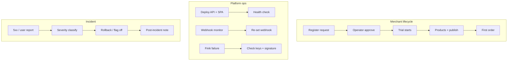

# Operational Audit

> **Phase:** Founder Exit — Audit 2/3  
> **Question:** Can the platform **run day-to-day** without founder intervention?

---

## 1. Executive summary

| Function | Documented | Automatable | Founder-required today |
|----------|------------|-------------|------------------------|
| Merchant registration approve | Runbook | Partial | Often yes |
| Deploy production | Checklist | Manual | Yes |
| Incident response | Partial table | No | Yes |
| Support escalation | Implicit | No | Yes |
| Monitoring | `/health` only | Minimal | Yes |
| Backups | Render default | Not verified | Unknown |
| Moderation | Block/disable | Manual | Operator |
| Beta feedback triage | API exists | No process | Yes |

**Verdict:** Operations are **beta-viable**, not **founder-independent**.

---

## 2. Critical flows map

### Flow documentation status

| Flow | Doc | Gap |
|------|-----|-----|
| Register → approve | `merchant-quickstart`, runbook | Reject reason templates missing |
| Deploy | `release-checklist.md` | No staging step |
| Rollback | Checklist § Rollback | Not practiced |
| Webhook failure | Runbook table | No mass-fail playbook |
| Finik payment fail | Runbook one line | No merchant-facing comms template |
| Support ticket | None | Escalation undefined |
| Security incident | Maturity audit only | No response playbook |
| DB disaster | “Restore backup” mention | No RTO/RPO, no test restore |

---

## 3. Release & deploy operations

| Item | Current | Founder dependency |
|------|---------|-------------------|
| CI | `npm run check` local only | Must remember to run |
| CD | Git push → Render/Vercel | Founder knows env vars |
| Migrations | Auto on start | Founder reads logs if fail |
| Frontend/API coupling | `VITE_API_URL` build-time | Founder coordinates |
| Release notes | None | — |
| Staging | Missing | Founder tests on prod risk |

**Target release cycle:** Bi-weekly minor, hotfix anytime — see [product-operating-model.md](../product-operating-model.md).

---

## 4. Support & escalation

### Current state

| Channel | Handler | SLA |
|---------|---------|-----|
| In-app feedback (`ProductFeedback`) | Operator API | Undefined |
| Support tickets (merchant) | Merchant admin | Merchant-defined |
| Telegram DMs to founder | Founder | Ad hoc |

### Target escalation matrix

| Severity | Example | Response | Escalate to |
|----------|---------|----------|-------------|
| **S0** | API down, payments broken | 15 min | Engineering |
| **S1** | Single merchant checkout fail | 4 h | Operator → engineering |
| **S2** | UX bug, feature request | 48 h | Operator |
| **S3** | Polish, docs | Backlog | — |

**Missing doc:** `guides/incident-response.md` (Phase 1).

---

## 5. Bug triage system (target)

| State | Meaning |
|-------|---------|
| `incoming` | New feedback / bug report |
| `confirmed` | Reproduced |
| `prioritized` | P0–P3 assigned |
| `scheduled` | In Now sprint |
| `done` | Fixed + verified |
| `wontfix` | Non-goal or duplicate |

**Sources:** `ProductFeedback`, operator notes, funnel anomalies, Sentry (Phase 1).

**Weekly triage:** 30 min Monday — operator + founder until delegated.

---

## 6. Monitoring & alerting gaps

| Signal | Tool today | Target |
|--------|------------|--------|
| API liveness | Render `/health` | ✅ |
| DB readiness | `/ready` | ✅ |
| 5xx rate | Render logs manual | Sentry + alert |
| Uptime | None | UptimeRobot |
| Webhook success | Per-shop manual check | Daily cron + operator digest |
| Funnel ingest | Admin API manual | Weekly auto report |
| Disk/DB size | Render dashboard | Monthly review |

---

## 7. Backup & recovery

| Asset | Backup | Tested restore |
|-------|--------|----------------|
| PostgreSQL | Render auto (plan-dependent) | ❌ Not documented |
| Media | Cloudinary | N/A |
| Bot tokens | Encrypted in DB | Depends on `BOT_TOKEN_SECRET_KEY` |
| Code | Git | ✅ |

**Action:** Quarterly restore drill to staging DB — document in incident guide.

---

## 8. Operational resilience checklist

| Playbook | Status | Priority |
|----------|--------|----------|
| API outage | Partial (runbook) | P1 expand |
| Migration failure | Partial | P1 |
| Finik outage | Missing | P1 |
| Telegram webhook mass fail | Partial | P1 |
| Security breach | Missing | P0 doc |
| Bad deploy rollback | Checklist | P1 practice |
| Data export request | Missing | P2 |

---

## 9. Team / role clarity

| Role | Can do today | Should own |
|------|--------------|------------|
| **Operator** | Approve, block, funnel, feedback | Day-to-day merchant ops |
| **Founder/product** | Everything else | Vision, roadmap, pricing |
| **Engineering** | Deploy, fix | Auth P0, staging, Sentry |
| **Merchant** | Self-serve admin | Catalog, design, orders |

**Gap:** No written RACI — add to operating model.

---

## 10. Phase 1 operational actions

| # | Action |
|---|--------|
| 1 | Write `guides/incident-response.md` |
| 2 | Define S0–S3 + escalation (operating model) |
| 3 | Weekly Mon ops ritual (funnel + feedback + triage) |
| 4 | Uptime monitor on `/health` |
| 5 | Quarterly backup restore test |
| 6 | Staging environment (from stability phase) |

---

## Related docs

- [Operator Runbook](../guides/operator-runbook.md)
- [Release Review](../reviews/release-review.md)
- [Product Operating Model](../product-operating-model.md)
