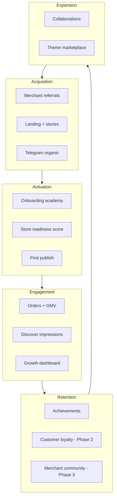

# Ecosystem Consolidation Strategy

> **Goal:** Network effects, retention, and “platform gravity” — merchants build inside ARCHA and don’t leave.

---

## 1. Strategic thesis

A SaaS subscription alone does not create dominance. Dominance comes from:

1. **Discovery** — buyers find stores through the platform  
2. **Trust** — verified merchants, quality scores, secure checkout signals  
3. **Growth loops** — referrals, collaborations, shared audiences  
4. **Switching cost (healthy)** — analytics history, loyalty, theme investment, reputation  

ARCHA must feel like **infrastructure + network**, not a replaceable bot wrapper.

---

## 2. Current foundation (shipped)

| Capability | Status | Path |
|------------|--------|------|
| Merchant referrals | ✅ | `MerchantReferralCode`, PlatformPage UI |
| Marketplace listing | ✅ | `PlatformStoreListing`, opt-in `isPublic` |
| Public discover | ✅ | `/discover`, `GET /api/discover/stores` |
| Trending signal | ✅ Partial | `trendScore` from `STORE_VIEW` events |
| Featured placement | ✅ Schema | `isFeatured`, `featuredRank` — operator tooling TBD |
| Growth dashboard | ✅ | Admin «Рост» tab |
| Retention nudges | ✅ | `merchantRetentionService` |
| Analytics events | ✅ | `StorefrontEvent`, funnel events |

---

## 3. Network effect layers



---

## 4. Consolidation pillars (mapped to user goals)

### 4.1 Platform network effects

| Feature | Phase | Design |
|---------|-------|--------|
| Merchant referrals | **Live** | Extend with rewards tier (Phase 2) |
| Merchant collaborations | Phase 2 | `MerchantCollaboration` — shared promo, bundle link |
| Ecosystem recommendations | Phase 2 | “Stores like yours” on discover + admin |
| Shared audiences | Phase 3 | Cross-store retargeting (privacy-safe, opt-in) |
| Cross-store discovery | **Live** | Expand discover rails on storefront home |

**Collaboration schema (Phase 2 stub):**

```prisma
model MerchantCollaboration {
  id              Int      @id @default(autoincrement())
  hostBusinessId  Int
  partnerBusinessId Int
  kind            String   // promo_bundle | co_banner | affiliate
  status          String   // pending | active | ended
  config          Json     @default("{}")
  startsAt        DateTime?
  endsAt          DateTime?
}
```

### 4.2 Commerce trust layer

| Signal | Phase | Implementation |
|--------|-------|----------------|
| Verified merchant | Phase 2 | Operator flag + `verifiedAt` on listing |
| Trust badges | Phase 2 | Render on discover card + storefront band |
| Secure checkout | Phase 2 | “Finik / оплата защищена” indicator |
| Support quality | Phase 3 | SLA score from ticket resolution time |
| Reliability score | Phase 2 | Composite: uptime, order fulfillment, dispute rate |

**Listing extension:**

```prisma
// PlatformStoreListing additions
verifiedAt       DateTime?
qualityScore     Int       @default(0)  // 0-100
trustBadges      String[]  // e.g. ["verified", "fast_shipping"]
```

### 4.3 Ecosystem retention

| Mechanic | Phase | Notes |
|----------|-------|-------|
| Merchant milestones | **Live** | Growth dashboard checklist → achievements UI |
| Storefront achievements | Phase 2 | “100 orders”, “First campaign” badges |
| Gamified growth | Phase 2 | Optional; avoid dark patterns |
| Customer loyalty | Phase 2 | Points, favorites — see monetization doc |

### 4.4 Platform community

| Program | Phase | Format |
|---------|-------|--------|
| Merchant community | Phase 3 | Telegram channel / group curated by ARCHA |
| Creator ecosystem | Phase 3 | Theme authors, template partners |
| Affiliate ecosystem | Phase 2 | Extend referral with payout tracking |
| Partner programs | Phase 3 | Agencies, integrators |

---

## 5. Merchant growth infrastructure

| Asset | Phase | Owner |
|-------|-------|-------|
| Commerce academy | Phase 2 | Docs + in-app «Обучение» tab |
| Growth tutorials | Phase 2 | Short TG-native cards, not PDF walls |
| Onboarding assistant | Phase 3 | Contextual bot + checklist (extends readiness) |
| Optimization recs | **Live** | Growth dashboard + insights |
| Conversion guidance | Phase 2 | Time-to-promo, weak category (AI commerce Phase 2) |

**Academy structure (content plan):**

1. Publish your first storefront (5 min)  
2. Connect Finik and first order  
3. Get discovered in ARCHA Discover  
4. Refer another merchant  
5. Run your first promo campaign  

---

## 6. Platform expansion readiness (architecture)

Prepare **interfaces now**, implementations later.

| Integration class | Phase | Pattern |
|-------------------|-------|---------|
| Public read API | Phase 2 | `/api/v1/discover`, `/api/v1/stores/:slug/meta` |
| Webhooks out | Phase 3 | Order events for partners |
| Payment providers | **Live** | Finik; abstract `PaymentProvider` interface |
| Delivery providers | Phase 3 | `DeliveryIntegration` config per business |
| External commerce tools | Phase 4 | Export catalog, Zapier-style |

**Auth model for partners:** API keys scoped to `businessId` + rate limits per plan.

---

## 7. Global platform readiness

| Concern | Current | Target |
|---------|---------|--------|
| i18n | Russian-primary | `ru` + `ky` + `en` string tables |
| Currency | KGS / “сом” hardcoded | `Business.currency` + format helper |
| Timezone | Server UTC | `Business.timezone` for promos / analytics |
| Regional settings | None | Phone/country validation per region |
| Storefront locale | Partial | Buyer language from TG user |

**Do not block Phase 1 on full i18n** — architect keys and currency abstraction first.

---

## 8. Founder / operator tooling

| Dashboard | Phase | Metrics |
|-----------|-------|---------|
| Ecosystem analytics | Phase 2 | Total GMV, active merchants, discover CTR |
| Growth analytics | Phase 2 | Referral funnel, publish rate |
| Retention / churn | Phase 2 | 30/60/90d merchant activity cohorts |
| Marketplace analytics | Phase 2 | Impressions, clicks, category mix |
| Platform health | **Partial** | `/health`, `/ready` — extend with job queue depth |

**New tables (Phase 2):**

```prisma
model PlatformDailyRollup {
  day            DateTime @db.Date
  activeMerchants Int
  publicListings  Int
  discoverViews   Int
  orders          Int
  gmvSom          Int
  @@id([day])
}
```

---

## 9. Success metrics

| Metric | 90-day target (indicative) |
|--------|----------------------------|
| Merchants with public listing | 30% of published stores |
| Referral-attributed signups | 10% of new merchants |
| Discover → store click rate | > 8% |
| 60-day merchant retention | > 70% |
| NPS (in-app feedback) | > 40 |

---

## 10. Phased execution

| Phase | Focus |
|-------|-------|
| **0 (now)** | Strategy docs, brand audit, identity config |
| **1** | Brand unification, discover UX polish, featured operator tools |
| **2** | Trust badges, verified merchants, academy v1, collaborations |
| **3** | Community, affiliate payouts, partner API, loyalty |
| **4** | Cross-store intelligence, enterprise, global i18n |

---

## Related docs

- [Platform Brand Audit](./platform-brand-audit.md)
- [Marketplace Dominance Strategy](./marketplace-dominance-strategy.md)
- [Platform Monetization Strategy](./platform-monetization-strategy.md)
