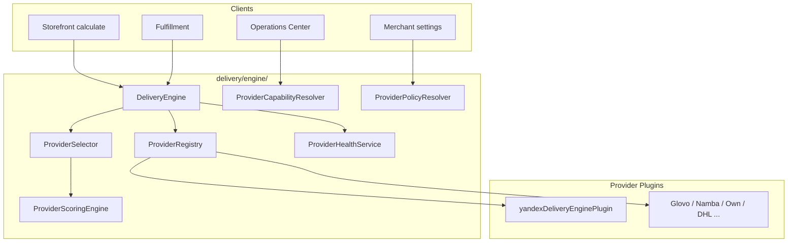
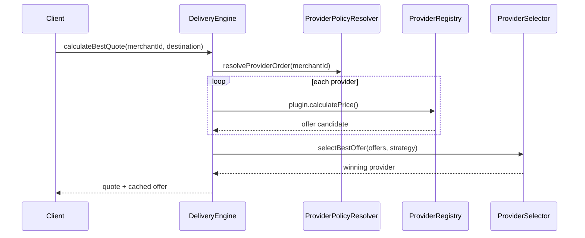
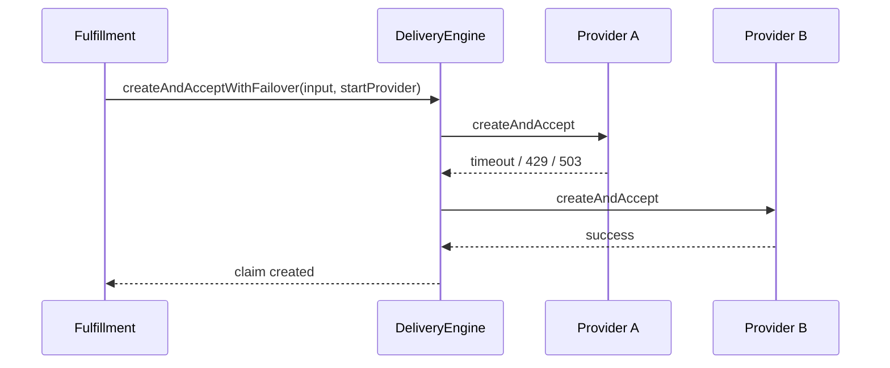

# Delivery Engine — Phase 7 Report

Multi-provider delivery engine: provider-agnostic architecture where Yandex is one plugin among many. Checkout, recovery, operations center, and tracking remain unchanged at the API level; business logic routes through the engine.

## Architecture



## Selection flow



## Failover flow



## Provider capabilities

Each plugin declares:

| Capability | Yandex (today) |
|------------|----------------|
| calculatePrice | yes |
| createClaim / acceptClaim | yes |
| tracking / webhook / eta | yes |
| liveLocation | yes |
| cancelClaim | no |
| returnDelivery / partialRefund / scheduledDelivery | no |

Operations Center uses `resolveOperationsCapabilityMatrix()` — actions hidden when unsupported.

## Scoring algorithm

Weighted score (strategy `CUSTOM`):

| Criterion | Default weight |
|-----------|----------------|
| Price (lower better) | 0.35 |
| ETA (lower better) | 0.25 |
| Health state | 0.20 |
| Success rate | 0.10 |
| Merchant priority | 0.05 |
| Availability | 0.05 |

Strategies: `CHEAPEST`, `FASTEST`, `BEST_HEALTH`, `MERCHANT_PRIORITY`, `CUSTOM`.

## Merchant delivery policy

Stored in `Business.deliverySettings.providerPolicy` (additive JSON):

- `preferredProviders` — priority order
- `strategy`, `maxPriceSom`, `maxEtaMinutes`
- `allowFallback`, `allowAutoSwitch`, `autoSelection`

Parser: `src/shared/merchantDeliveryProviderPolicy.ts`

## Health states

| State | Condition (approx.) |
|-------|---------------------|
| HEALTHY | failureRate &lt; 20% |
| DEGRADED | elevated failures / 429 / timeouts |
| UNAVAILABLE | failureRate ≥ 50% or timeout ≥ 40% |

In-memory per-provider counters via `ProviderHealthService`.

## API reference

| Method | Path | Auth |
|--------|------|------|
| GET | `/api/delivery/providers` | Public (Telegram gate) |
| GET | `/api/merchant/delivery/providers` | `settings.manage` |
| PATCH | `/api/merchant/delivery/providers` | `settings.manage` |
| GET | `/api/operator/delivery/providers/dashboard` | Operator unlock |
| GET | `/api/operator/delivery/providers/analytics` | Operator unlock |

`POST /api/delivery/calculate` now routes through `DeliveryEngine` by default (`useEngine !== false`).

## Plugin guide (add a new provider)

1. Create `src/server/delivery/providers/<name>/<name>DeliveryEnginePlugin.ts`
2. Implement `DeliveryEnginePlugin`:
   - `capabilities`, `isAvailable()`, optional `calculatePrice`, `createAndAccept`
3. Register recovery + operations ports if needed
4. Call `registerDeliveryEnginePlugin(plugin)` from bootstrap
5. Add provider id to merchant `preferredProviders`

**No changes** required to checkout, recovery scheduler, operations routes, or tracking.

## Files created

```
src/server/delivery/engine/
  DeliveryEngine.ts
  ProviderRegistry.ts
  ProviderSelector.ts
  ProviderScoringEngine.ts
  ProviderHealthService.ts
  ProviderCapabilityResolver.ts
  ProviderPolicyResolver.ts
  deliveryEngineBootstrap.ts
  deliveryEngineRoutes.ts
  types/deliveryEngineTypes.ts
  ports/deliveryEnginePluginPort.ts
  services/deliveryProviderAnalyticsService.ts

src/server/delivery/providers/yandex/yandexDeliveryEnginePlugin.ts
src/shared/merchantDeliveryProviderPolicy.ts
tests/smoke/deliveryEnginePhase7.test.ts
```

## Files modified (additive)

- `deliveryProviderPort.ts`, `deliveryProviderRegistry.ts` — string `providerId`, engine delegation
- `deliveryProviderRecoveryRegistry.ts` — string provider id
- `deliveryPriceTypes.ts`, `providerDeliveryTypes.ts` — widen provider type
- `deliveryOfferCache.ts` — optional `provider` field
- `deliveryCalculateRoute.ts` — engine calculate path
- `deliveryFulfillmentService.ts` — failover via `createDeliveryWithFailover`
- `deliveryOperationsDetailService.ts` — capability matrix in actions
- `index.ts` — engine routes + bootstrap import

## Phase 8 prep

- Glovo / Namba plugin implementations
- Per-merchant provider credentials
- Real-time provider health from Prometheus
- UI provider configuration in merchant settings screen
- Unified checkout fee from engine quote (optional bridge)

## Verification

1. `npm test` — Phase 7 + existing delivery tests pass
2. `npm run build` succeeds
3. `GET /api/delivery/providers` lists Yandex with capabilities + health
4. `PATCH /api/merchant/delivery/providers` persists policy
5. Calculate + fulfillment unchanged for single-provider (Yandex) deployments
6. No Yandex imports in `delivery/engine/` core modules
