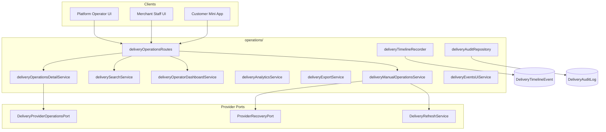

# Delivery Operations Platform — Phase 6 Report

Production-grade **Delivery Operations Center** for merchants and platform operators. Provider-agnostic: works with Yandex today and future providers (Glovo, Namba, own couriers) via registry ports.

Phases 1–5 remain unchanged except additive timeline hooks (one-line `recordDeliveryTimeline` calls).

## Architecture



## Operations module layout

```
src/server/delivery/operations/
├── deliveryOperationsRoutes.ts
├── controllers/          (handlers inlined in routes for Express)
├── services/
│   ├── deliveryOperationsDetailService.ts
│   ├── deliveryOperatorDashboardService.ts
│   ├── deliverySearchService.ts
│   ├── deliveryAnalyticsService.ts
│   ├── deliveryExportService.ts
│   ├── deliveryManualOperationsService.ts
│   ├── deliveryEventsUiService.ts
│   └── deliveryTimelineRecorder.ts
├── repositories/
│   ├── deliveryTimelineRepository.ts
│   ├── deliveryAuditRepository.ts
│   └── deliveryOperationsRepository.ts
├── dto/deliveryOperationsDto.ts
├── types/deliveryOperationsTypes.ts
└── utils/deliveryOperationsLogging.ts
```

## Database (Phase 6 migration)

`prisma/migrations/20260710120000_delivery_operations_phase6/`

| Model | Purpose |
|-------|---------|
| `DeliveryTimelineEvent` | Append-only chronological timeline per delivery |
| `DeliveryAuditLog` | Immutable audit records (actor, action, safe details) |

Enums: `DeliveryTimelineKind`, `DeliveryAuditActor` (`SYSTEM`, `WEBHOOK`, `RECOVERY`, `MERCHANT`, `PLATFORM_OPERATOR`).

## API reference

### Platform operator (requires `requireOperatorUnlock` / `requireOperatorRecentReauth` for mutations)

| Method | Path | Description |
|--------|------|-------------|
| GET | `/api/operator/delivery/dashboard` | Advanced platform dashboard |
| GET | `/api/operator/delivery/search` | Paginated search (all tenants) |
| GET | `/api/operator/delivery/analytics` | Daily/weekly/monthly analytics |
| GET | `/api/operator/delivery/export` | CSV / Excel / JSON export |
| GET | `/api/operator/deliveries/:deliveryId` | Full delivery details |
| GET | `/api/operator/deliveries/:deliveryId/timeline` | Normalized timeline events |
| GET | `/api/operator/deliveries/:deliveryId/audit` | Audit log |
| POST | `/api/operator/deliveries/:deliveryId/refresh` | Manual refresh |
| POST | `/api/operator/deliveries/:deliveryId/force-refresh` | Force refresh |
| POST | `/api/operator/deliveries/:deliveryId/retry-recovery` | Manual recovery retry |

### Merchant (`orders.manage`, tenant-scoped)

| Method | Path |
|--------|------|
| GET | `/api/merchant/delivery/search` |
| GET | `/api/merchant/delivery/:deliveryId` |
| GET | `/api/merchant/delivery/:deliveryId/timeline` |
| GET | `/api/merchant/delivery/analytics` |
| POST | `/api/merchant/delivery/:deliveryId/refresh` |

### Customer (order ownership)

| Method | Path |
|--------|------|
| GET | `/api/delivery/:orderId/events` |

Search filters: `claimId`, `orderId`, `merchantId`, `customerName`, `phone`, `provider`, `status`, `recoveryStatus`, `dateFrom`, `dateTo`, `page`, `pageSize`.

Export query: `type=dashboard|analytics|timeline|audit|search`, `format=csv|excel|json`.

## Timeline

Append-only events recorded from:

- Fulfillment (`CLAIM_CREATED`, `CLAIM_ACCEPTED`)
- Webhooks (`WEBHOOK_RECEIVED` + status via `deliveryRefreshApplyService`)
- Recovery scheduler (`RECOVERY_RETRY`, `RECOVERY_RESOLVED`)
- Manual operations (`MANUAL_REFRESH`, `FORCE_REFRESH`, `MANUAL_RETRY`)

## Manual operations

Provider-agnostic via `ProviderRecoveryPort` + `DeliveryRefreshService`:

- Refresh / force refresh → `refreshClaim`
- Retry recovery → provider port + recovery state update
- Open provider → `DeliveryProviderOperationsPort.getProviderPortalUrl`
- Copy IDs → returned in `actions.copy` (client-side)
- Download timeline → export API

## Permissions

| Role | Scope |
|------|-------|
| Platform operator | All deliveries, audit log, exports |
| Merchant staff (`orders.manage`) | Own `businessId` only |
| Customer | Own order events only |

`/api/operator/*` requires verified Telegram + operator session (same as `/api/platform`).

## Observability

New in-memory metrics (additive):

- `delivery_manual_refresh_total`
- `delivery_recovery_total`
- `delivery_export_total`
- `delivery_search_total`
- `delivery_timeline_total`

Structured logs: `delivery_opened`, `delivery_refreshed`, `delivery_exported`, `delivery_searched`, `delivery_timeline_loaded`.

Never logged: OAuth, addresses, phones, coordinates, provider payload.

## Files created

- Migration + Prisma models
- Full `operations/` module (~15 files)
- `deliveryProviderOperationsPort.ts` + registry + Yandex impl
- `tests/smoke/deliveryOperationsPhase6.test.ts`
- This report

## Files modified (additive only)

- `prisma/schema.prisma` — timeline + audit models
- `privilegedRoutes.ts` — `/api/operator` Telegram gate
- `index.ts` — route wiring
- `deliveryMetrics.ts` — Phase 6 counters
- `deliveryFulfillmentService.ts`, `DeliveryRefreshService.ts`, `deliveryRefreshApplyService.ts`, `deliveryRecoveryService.ts` — timeline hooks

## Phase 7 prep

- Operator UI frontend (Operations Center)
- Real-time push via `subscribeDeliveryEvents` → WebSocket/SSE
- Telegram ops alerts for `RECOVERY_REQUIRED`
- Per-provider portal deep links
- Redis-backed search index for scale

## Verification

1. `npx prisma generate` + `npx prisma migrate deploy`
2. `npm test` — Phase 5 + Phase 6 smoke tests pass
3. `npm run build` succeeds
4. Operator dashboard/search/details with unlocked session
5. Merchant search scoped to tenant
6. Customer events only for owned orders
7. Export CSV/JSON without secrets
8. Manual refresh increments `delivery_manual_refresh_total`
