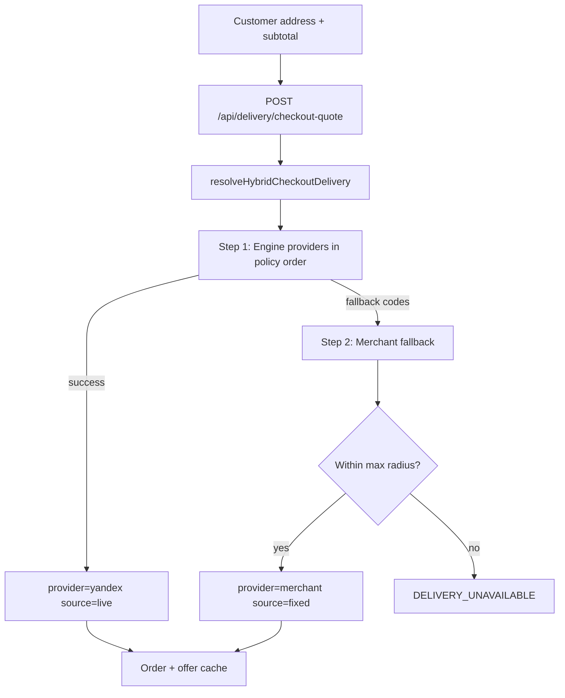

# Hybrid Delivery Checkout — Phase 8.5 Report

**Date:** 2026-06-10  
**Status:** Implemented

## Business rule — merchant-owned delivery is not marketplace payment

When `deliveryProvider = "merchant"` (merchant fallback / fixed pricing):

| Aspect | Behavior |
|--------|----------|
| Fee ownership | Belongs to the merchant |
| Customer payment | **One** Finik payment to the merchant account (`order.total` = goods + merchant delivery fee) |
| ARCHA | Calculates fee only; **never** receives, holds, or splits the merchant delivery fee |
| Split / payout | **None** |
| `deliveryOfferId` | Always `null` |
| `ProviderDelivery` | **Not** created |
| Provider claim | **Not** created (Yandex/Glovo/Namba fulfillment skipped) |

Only **provider-based** deliveries (`deliveryProvider` = `yandex`, `glovo`, … with a live `deliveryOfferId`) may use marketplace split-payment or payout flows in the future.

Enforced in code via `isMerchantOwnedDelivery` / `requiresProviderDeliveryFulfillment` (`hybridDeliveryCheckout.ts`) and early return in `deliveryFulfillmentService`.

## Goal

Unify checkout delivery pricing into a single server pipeline: try live provider quotes via the Delivery Engine (Yandex first, future plugins by policy order), fall back to merchant fixed/distance pricing with a max-radius cap, persist provider metadata on orders, and drive Checkout UI from one API.

## Architecture

## Decision flow

### Step 1 — Live providers

- Iterates providers from `ProviderPolicyResolver.resolveProviderOrder`.
- First successful `calculatePrice` wins.
- Maps to checkout quote: `calculationSource=live`, `providerOfferId` from plugin, neutral `displayLabel`.

**Fallback-eligible provider errors** (proceed to Step 2):

- `tariff_unavailable`, `provider_unavailable`, `provider_timeout`, `provider_rate_limit`, `unknown_provider_error`

**No fallback** (fail immediately):

- `invalid_coordinates`, `merchant_not_found`, `delivery_disabled`, `merchant_unavailable`

### Step 2 — Merchant fallback

- `haversineDistanceKm` from store → customer.
- **Max radius:** last `deliveryZones[].maxKm` in store availability, else last `distanceTiers[].maxKm` in merchant delivery settings.
- If distance exceeds cap → `DELIVERY_UNAVAILABLE` with Russian copy.
- Otherwise `computeDeliveryQuote` (unchanged pricing modes).
- Maps to `provider=merchant`, `calculationSource=fixed`, `providerOfferId=null`.

### Pickup

- Skips engine; returns fee `0`, `provider=null`.

## API

| Route | Purpose |
|-------|---------|
| `POST /api/delivery/checkout-quote` | Checkout quote (hybrid resolver) |
| `POST /api/delivery/calculate` | Unchanged — admin/debug, best-offer engine |

Request body: `merchantId`, `destination`, `subtotalSom`, `fulfillmentMode`.

## Order persistence

New fields on `Order`:

| Field | Example | Purpose |
|-------|---------|---------|
| `deliveryProvider` | `yandex`, `merchant` | Winning provider at checkout |
| `deliveryCalculationSource` | `live`, `fixed` | Quote source |
| `deliveryEtaMinutes` | `35` | ETA snapshot |

Existing: `deliveryFee`, `deliveryOfferId` (live offers only).

Server checkout step re-runs `resolveHybridCheckoutDelivery` authoritatively; client `deliveryOfferId` is informational only.

## Analytics

Counters in `deliveryMetrics.ts`:

- `checkout_delivery_live_total`
- `checkout_delivery_merchant_fallback_total`
- `checkout_delivery_unavailable_total`
- `checkout_delivery_provider_selected`

Structured log: `checkout_delivery_resolved` with `{ provider, source, fallbackUsed, merchantId }`.

## Files

| Action | Path |
|--------|------|
| Create | `engine/hybridCheckoutDeliveryResolver.ts`, `engine/merchantDeliveryFallback.ts` |
| Create | `deliveryCheckoutQuoteRoute.ts`, `src/shared/hybridDeliveryCheckout.ts` |
| Create | `frontend/src/hooks/useCheckoutDeliveryQuote.ts` |
| Create | `tests/smoke/hybridCheckoutDelivery.test.ts` |
| Modify | `DeliveryEngine.ts`, `deliveryMetrics.ts`, `index.ts`, `CheckoutPage.tsx` |
| Modify | `deliveryQuoteService.ts` (@deprecated), `prisma/schema.prisma` + migration |
| Unchanged | `merchantDeliverySettings.ts`, merchant settings UI, engine plugins |

## Verification checklist

- [x] `npm test` — hybrid + delivery/checkout tests
- [x] `npm run build` (root + frontend)
- [x] Checkout no longer uses client `computeDeliveryQuote` for fee
- [x] Server checkout uses `resolveHybridCheckoutDelivery` (not `resolveCheckoutDeliveryQuote`)
- [x] Yandex live path: order gets `deliveryProvider=yandex`, `deliveryOfferId`, fulfillment runs
- [x] Merchant fallback: `deliveryProvider=merchant`, no `deliveryOfferId`, fulfillment skips
- [x] Outside max radius → blocked with clear message

## Future providers

Register plugins in the engine; policy order handles Step 1 automatically. Checkout UI and hybrid resolver require no changes.
