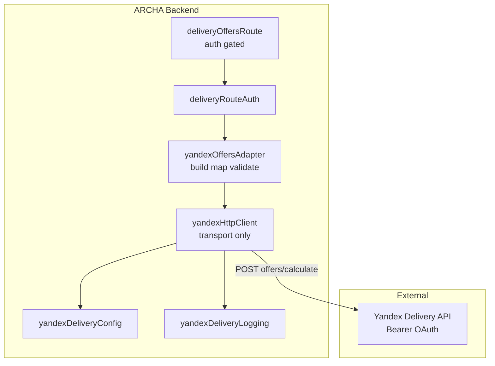

# Yandex Delivery — Phase 1 Foundation Report

**Date:** 2026-06-10  
**Scope:** Infrastructure only (HTTP client, config, logging, auth-gated debug route). No checkout, merchant pricing, or claims integration.

---

## Summary

Phase 1 delivers a production-ready Yandex Delivery transport layer under `src/server/delivery/`. The platform OAuth token stays server-side; the debug `GET /api/delivery/offers` endpoint now requires merchant staff (`settings.manage`) or an unlocked platform operator.

---

## Architecture

**Data flow:**

1. Authenticated caller hits `GET /api/delivery/offers` (debug only).
2. Route parses query params → `calculateOffers()` in adapter.
3. Adapter validates input, uses mock if `YANDEX_DELIVERY_USE_MOCK=1`, else builds Yandex body and calls HTTP client.
4. HTTP client adds Bearer token, `X-Request-Id`, timeout, retries; logs request/response metadata only.
5. Adapter maps HTTP/transport errors to domain result codes; normalizes offers for ARCHA.

---

## Files created

| File | Purpose |
|------|---------|
| `src/server/delivery/deliveryRouteAuth.ts` | Merchant or platform operator gate |
| `src/server/delivery/providers/yandex/client/yandexHttpClient.ts` | Reusable HTTP transport |
| `src/server/delivery/providers/yandex/adapters/yandexOffersAdapter.ts` | offers/calculate adapter |
| `src/server/delivery/providers/yandex/dto/yandexOffersDto.ts` | Yandex wire-format DTOs |
| `src/server/delivery/providers/yandex/types/yandexDeliveryTypes.ts` | ARCHA domain types + result unions |
| `src/server/delivery/providers/yandex/services/yandexDeliveryConfig.ts` | Centralized env config |
| `src/server/delivery/providers/yandex/utils/yandexDeliveryLogging.ts` | Safe structured logs |
| `src/server/delivery/providers/yandex/utils/yandexLogSanitize.ts` | PII field stripping |
| `tests/smoke/yandexHttpClient.test.ts` | HTTP client unit tests |
| `docs/integrations/yandex-delivery-phase1-report.md` | This report |

---

## Files modified

| File | Change |
|------|--------|
| `src/server/delivery/deliveryOffersRoute.ts` | Auth gate, correlation id, structured error logging |
| `src/server/envValidation.ts` | `validateYandexDeliveryEnv()` production rules |
| `src/server/index.ts` | `tryOperatorUnlockSilent`, route deps wiring |
| `.env.example` | Documented retry and path env vars |
| `tests/smoke/yandexOffersAdapter.test.ts` | Updated import paths |

---

## Files removed (replaced by new layout)

| File |
|------|
| `src/server/delivery/providers/yandex/yandexDeliveryConfig.ts` |
| `src/server/delivery/providers/yandex/yandexOffersAdapter.ts` |
| `src/server/delivery/providers/yandex/yandexOffersTypes.ts` |

---

## Environment variables

| Variable | Required | Default | Notes |
|----------|----------|---------|-------|
| `YANDEX_DELIVERY_OAUTH_TOKEN` | Yes (prod, mock off) | — | Platform token; never logged or exposed to clients |
| `YANDEX_DELIVERY_API_BASE` | No | `https://b2b.taxi.yandex.net` | Must be `https://` in production (warning) |
| `YANDEX_DELIVERY_USE_MOCK` | No | off | **Forbidden in production** |
| `YANDEX_DELIVERY_TIMEOUT_MS` | No | `15000` | Per-request timeout (max 60000) |
| `YANDEX_DELIVERY_HTTP_MAX_RETRIES` | No | `2` | Retries after first attempt (max 5) |
| `YANDEX_DELIVERY_HTTP_RETRY_BASE_MS` | No | `500` | Exponential backoff base (max 5000) |
| `YANDEX_DELIVERY_OFFERS_PATH` | No | `/b2b/cargo/integration/v2/offers/calculate` | Relative path on API base |

**Legacy aliases (backward compat):** `YANDEX_DELIVERY_API_TOKEN`, `YANDEX_DELIVERY_TOKEN`, `YANDEX_DELIVERY_API_BASE_URL`.

---

## HTTP client behavior

- **Auth:** `Authorization: Bearer <token>` from config only.
- **Request ID:** `X-Request-Id` header (UUID if not provided); `correlationId` from Express logged when present.
- **Retries:** On `429`, `502`, `503`, `504`, network errors, timeouts. No retry on `400`, `401`, `403`, `409`.
- **Backoff:** `retryBaseMs * 2^attempt` + jitter, capped at 8s.
- **Logging:** `yandex_delivery_request` / `yandex_delivery_response` with `requestId`, `endpoint` (path only), `httpStatus`, `durationMs`, `attempt`. Never logs token, bodies, addresses, or phone numbers.

---

## Security

- `GET /api/delivery/offers` requires:
  - Unlocked **platform operator** session, or
  - **Merchant staff** with `settings.manage` for the tenant (`shop` / `x-business-id`).
- Unauthenticated → **401**; authenticated but unauthorized → **403**.
- Yandex OAuth token is only used server-side in the HTTP client.

---

## Explicitly unchanged (Phase 1)

- `src/server/deliveryQuoteService.ts` — merchant JSON pricing for checkout
- `src/shared/merchantDeliverySettings.ts` — merchant delivery settings
- `frontend/src/pages/CheckoutPage.tsx` — checkout flow
- Merchant delivery admin panels
- `src/server/deliveryService.ts` — order delivery stages
- Prisma schema, claims, webhooks

---

## Remaining risks

| Risk | Severity | Notes |
|------|----------|-------|
| `offers/calculate` is Russia-oriented | Critical | Bishkek/KG routes may return `409 tariffs_unavailable`; Phase 2 needs `check-price` or alternate provider |
| Debug route accepts addresses in query | Medium | Backend does not log them; callers must remain authenticated staff only |
| `offer_ttl` not mapped | Medium | Offer IDs may be unstable for claims flow |
| Code deploy drift | Medium | Ensure Phase 1 is committed and deployed before Phase 2 |
| Timeout retries add latency | Low | Default 3 attempts on timeout; tune `YANDEX_DELIVERY_HTTP_MAX_RETRIES` if needed |

---

## Recommendations before Phase 2

1. **Provider port:** Introduce `DeliveryOffersPort` + registry (mirror Finik adapter pattern in `src/server/finik/`).
2. **KG pricing:** Implement `check-price` adapter for Kyrgyzstan routes with geo validation.
3. **Checkout integration:** Wire `delivery_quote` behind a feature flag; keep merchant JSON pricing as fallback.
4. **Offer persistence:** Map `offer_ttl`; store selected offer `payload` on order at checkout time.
5. **Claims:** Add `claims/create` only after offer selection is stable in checkout.
6. **Ops:** Remove or further restrict debug route once internal admin tooling exists.

---

## Verification

- `npm test -- tests/smoke/yandexHttpClient.test.ts tests/smoke/yandexOffersAdapter.test.ts` — 12 tests passing
- `npm run build` — TypeScript clean
- Manual: unauthenticated `GET /api/delivery/offers` → 401
- Manual: merchant with `settings.manage` or unlocked operator → 200 (with `YANDEX_DELIVERY_USE_MOCK=1`)
