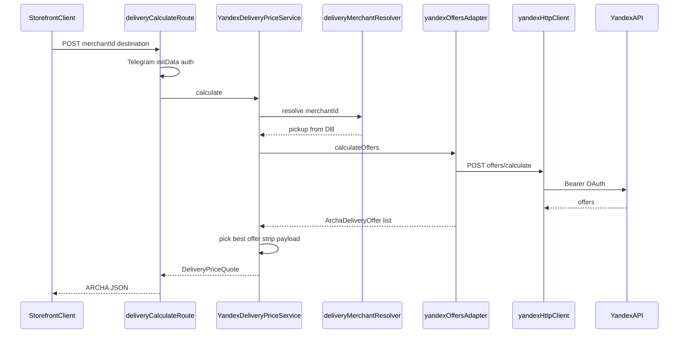

# Yandex Delivery — Phase 2 Price Engine Report

**Date:** 2026-06-10  
**Scope:** Delivery price calculation via Yandex `offers/calculate` through a single backend endpoint. No checkout, claims, or persistence.

---

## Summary

Phase 2 adds `YandexDeliveryPriceService` as the single entry point for Yandex delivery pricing, `POST /api/delivery/calculate` for storefront customers (Telegram auth), and merchant pickup resolution from the `Business` table. Raw Yandex `payload` is never returned to clients.

---

## Architecture



**Layer responsibilities:**

| Layer | File | Role |
|-------|------|------|
| Route | `deliveryCalculateRoute.ts` | Auth, Zod validation, HTTP status mapping |
| Service | `YandexDeliveryPriceService.ts` | Domain orchestration, offer selection, error mapping |
| Resolver | `deliveryMerchantResolver.ts` | Merchant load, subscription gate, delivery enabled, pickup coords |
| Adapter | `yandexOffersAdapter.ts` | Yandex request build/response map |
| Client | `yandexHttpClient.ts` | Transport (Phase 1) |

---

## Endpoint

### `POST /api/delivery/calculate`

**Auth:** Verified Telegram Mini App (`x-telegram-init-data`). Missing auth → **401**.

**Request body (strict — `pickup` rejected):**

```json
{
  "merchantId": 42,
  "destination": {
    "latitude": 42.8765,
    "longitude": 74.6122
  },
  "weightKg": 1
}
```

| Field | Required | Notes |
|-------|----------|-------|
| `merchantId` | Yes | `Business.id` |
| `destination.latitude` | Yes | −90…90 |
| `destination.longitude` | Yes | −180…180 |
| `weightKg` | No | Default `1` |

Pickup address and coordinates are loaded server-side from `Business.addressLine`, `city`, `latitude`, `longitude`.

**Success response (200):**

```json
{
  "ok": true,
  "quote": {
    "provider": "yandex",
    "available": true,
    "price": 200,
    "currency": "KGS",
    "etaMinutes": 38,
    "providerOfferId": "courier:courier_slow",
    "expiresAt": "2026-06-10T12:30:00+00:00"
  }
}
```

**Error response:**

```json
{
  "ok": false,
  "code": "tariff_unavailable",
  "message": "Доставка по этому маршруту сейчас недоступна."
}
```

---

## Error codes

| Code | HTTP | When |
|------|------|------|
| `merchant_not_found` | 404 | Unknown `merchantId` |
| `merchant_unavailable` | 403 | Blocked, inactive, or subscription gate |
| `delivery_disabled` | 403 | `storeAvailabilitySettings.deliveryEnabled === false` |
| `invalid_coordinates` | 400 | Bad destination or missing merchant pickup coords |
| `tariff_unavailable` | 409 | No Yandex offers for route |
| `provider_timeout` | 504 | Yandex request timeout |
| `provider_rate_limit` | 429 | Yandex 429 |
| `provider_unavailable` | 502 | Network / not configured |
| `unknown_provider_error` | 502 | Other provider errors |

Frontend never receives raw Yandex error text or `payload`.

---

## Offer selection

Among returned offers, the service picks:
1. Lowest `price`
2. Tie-break: `express` before `courier` before others

`etaMinutes` = midpoint of `deliveryEta` interval minus now (minutes).  
`expiresAt` = Yandex `offer_ttl` when present.

---

## Logging

**Event:** `yandex_delivery_price_calculate`

**Logged:** `requestId`, `correlationId`, `merchantId`, `provider`, `durationMs`, `ok`, `code`, `httpStatus`

**Never logged:** OAuth token, coordinates, addresses, phone, names, Yandex payload/bodies.

---

## Files created

| File |
|------|
| `src/server/delivery/types/deliveryPriceTypes.ts` |
| `src/server/delivery/services/deliveryMerchantResolver.ts` |
| `src/server/delivery/providers/yandex/services/YandexDeliveryPriceService.ts` |
| `src/server/delivery/deliveryCalculateRoute.ts` |
| `src/server/delivery/providers/yandex/utils/yandexPriceLogging.ts` |
| `tests/smoke/yandexDeliveryPriceService.test.ts` |
| `docs/integrations/yandex-delivery-phase2-report.md` |

## Files modified

| File | Change |
|------|--------|
| `src/server/delivery/providers/yandex/types/yandexDeliveryTypes.ts` | `expiresAt` on `ArchaDeliveryOffer` |
| `src/server/delivery/providers/yandex/adapters/yandexOffersAdapter.ts` | Map `offer_ttl`, mock `expiresAt` |
| `src/server/index.ts` | Wire `attachDeliveryCalculateRoutes` |
| `tests/smoke/yandexOffersAdapter.test.ts` | `expiresAt` assertion |

## Unchanged (per scope)

- `deliveryQuoteService.ts`, checkout, merchant admin, Prisma schema, frontend

---

## Remaining risks

| Risk | Severity | Notes |
|------|----------|-------|
| `offers/calculate` Russia-oriented | Critical | Bishkek routes may return `tariff_unavailable`; Phase 3 may need `check-price` |
| `payload` not persisted | High | Claims/checkout need server-side offer cache in Phase 3 |
| Default weight 1 kg | Medium | Cart weight not wired until checkout integration |
| Destination label generic | Low | Yandex gets `"Delivery point"`; coords drive routing |

---

## Phase 3 recommendations

1. **Offer cache:** Short-TTL in-memory map `providerOfferId → payload` for claims flow.
2. **Checkout integration:** Call `YandexDeliveryPriceService` from `delivery_quote` behind feature flag; keep merchant JSON pricing fallback.
3. **KG pricing:** Add `check-price` adapter for Kyrgyzstan if `offers/calculate` stays unavailable.
4. **Cart weight:** Pass line-item weight from checkout into `weightKg`.
5. **Claims:** `claims/create` only after offer selection is persisted on order.

---

## Verification

- `npm test -- tests/smoke/yandexDeliveryPriceService.test.ts tests/smoke/yandexOffersAdapter.test.ts` — 15 tests passing
- `npm run build` — TypeScript clean
