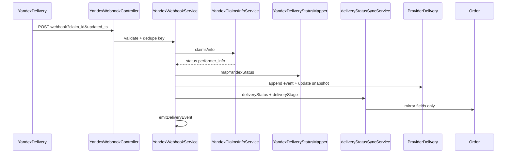

# Yandex Delivery — Phase 4 Report

Real-time delivery tracking via Yandex push webhooks, `claims/info` enrichment, centralized status mapping, `ProviderDelivery` + `Order` field sync, and customer/merchant tracking APIs.

## Architecture



## Full delivery lifecycle

### Phase 3 (fulfillment)

```
NEW → CREATED → ACCEPTED → SEARCHING_COURIER
```

### Phase 4 (webhooks)

```
SEARCHING_COURIER → COURIER_ASSIGNED → COURIER_AT_PICKUP → PICKED_UP → DELIVERING → DELIVERED
                                                                              ↘ CANCELLED / FAILED
```

### Order sync (independent from `Order.status`)

| `ProviderDelivery.status` | `Order.deliveryStatus` | `Order.deliveryStage` |
|---------------------------|------------------------|------------------------|
| Same mirror | Same mirror | Mapped via `YandexDeliveryStatusMapper` |

`Order.status` (CONFIRMED, SHIPPED, etc.) is **not** modified by webhooks.

## Webhook endpoint

`POST /api/delivery/providers/yandex/webhook`

- Exempt from Telegram `verifiedTelegramGate`
- Rate limited via `webhooksLimiter`
- Optional auth: `YANDEX_DELIVERY_WEBHOOK_SECRET` (Bearer or `?token=`)
- Yandex sends `claim_id` + `updated_ts` as query params; body may be empty
- Always responds 200 for unknown claim / unknown status (avoid Yandex retry storms)

## Tracking APIs

| Endpoint | Auth | Exposes |
|----------|------|---------|
| `GET /api/delivery/:orderId/tracking` | Customer Telegram + order ownership | status, ETA, courier name/vehicle, trackingUrl |
| `GET /api/delivery/:orderId/tracking/merchant` | `orders.manage` | + phone, price, providerStatus, claimId, deliveryStage |

Never exposes `providerPayload` or raw Yandex response.

## Internal events

`deliveryEvents.ts` — emit-only bus for Phase 5 Telegram:

- `delivery_status_changed`
- `courier_assigned`
- `delivery_completed`
- `delivery_cancelled`

## Idempotency

1. Unique `webhookKey` = `claimId:updated_ts` on `ProviderDeliveryStatusEvent`
2. Duplicate insert → skip snapshot/order updates
3. Monotonic `providerUpdatedAt` guard on snapshot updates
4. Monotonic `statusRank` guard on `Order.deliveryStatus`

## Files created

| File | Role |
|------|------|
| `prisma/migrations/20260704120000_provider_delivery_tracking_phase4/` | Schema migration |
| `yandexClaimsInfoDto.ts`, `yandexClaimsInfoAdapter.ts`, `YandexClaimsInfoService.ts` | claims/info |
| `YandexDeliveryStatusMapper.ts` | Centralized status mapping |
| `YandexWebhookService.ts`, `YandexWebhookController.ts` | Webhook orchestration |
| `deliveryYandexWebhookRoute.ts` | Route mount |
| `deliveryStatusSyncService.ts` | Order field sync |
| `deliveryEvents.ts` | Internal event bus |
| `deliveryTrackingService.ts`, `deliveryTrackingRoute.ts` | Tracking APIs |
| `yandexWebhookLogging.ts` | Structured logs |
| 4 test files + this report |

## Files modified (additive)

| File | Change |
|------|--------|
| `prisma/schema.prisma` | Extended enum, tracking columns, events table, `Order.deliveryStatus` |
| `providerDeliveryTypes.ts`, `providerDeliveryRepository.ts` | Tracking + event methods |
| `yandexDeliveryConfig.ts` | claims/info, webhook URL/secret |
| `yandexClaimsDto.ts`, `yandexClaimsAdapter.ts` | Optional `callback_properties` |
| `privilegedRoutes.ts` | Webhook telegram exemption |
| `index.ts` | Mount webhook + tracking routes |
| `.env.example` | Phase 4 env vars |

## Environment variables

| Variable | Default | Purpose |
|----------|---------|---------|
| `YANDEX_DELIVERY_CLAIMS_INFO_PATH` | `/b2b/cargo/integration/v2/claims/info` | Claim details |
| `YANDEX_DELIVERY_WEBHOOK_BASE_URL` | — | `callback_url` for claim create (must end with `?`) |
| `YANDEX_DELIVERY_WEBHOOK_SECRET` | — | Optional webhook auth |

## Security

- Webhook excluded from Telegram gate; optional shared secret
- PII never logged (phone, addresses, coordinates, raw payload)
- Customer API strips courier phone
- Merchant API scoped by `businessId`

## Risks

- Yandex webhooks are push-only hints — `claims/info` required for truth
- Ephemeral single-instance; multi-instance needs shared idempotency store in Phase 5
- `callback_url` must end with `?` per Yandex API docs

## Phase 5 prep

- Telegram notifications via `subscribeDeliveryEvents`
- Cancel/retry flows
- `claims/journal` polling fallback
- Redis-backed webhook dedupe
- Multi-provider webhook routing

## Verification

```bash
npx prisma generate
npm test
npm run build
```
