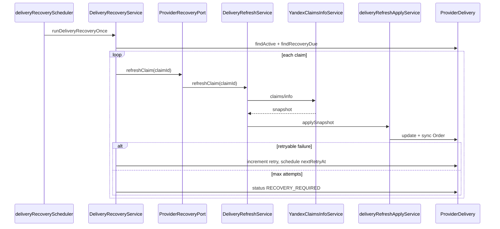
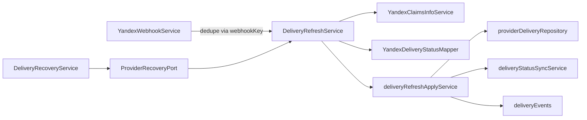

# Yandex Delivery — Phase 5 Report

Production reliability layer: shared refresh path for webhooks and recovery polling, retry policy with dead-letter (`RECOVERY_REQUIRED`), health probe, merchant dashboard aggregates, in-memory metrics, and operational runbook.

## Architecture



### Shared refresh path (webhook + recovery)



## Recovery states

Monitor states polled when `providerUpdatedAt` is stale (default 5 min):

`CREATED`, `SEARCHING_COURIER`, `COURIER_ASSIGNED`, `COURIER_AT_PICKUP`, `PICKED_UP`, `DELIVERING`

### Dead letter: `RECOVERY_REQUIRED`

When `recoveryRetryCount >= DELIVERY_RECOVERY_MAX_ATTEMPTS` (default 8):

- `status = RECOVERY_REQUIRED` (terminal ops state — delivery remains visible)
- `recoveryLastError` stores safe domain code
- Scheduler continues polling with longer backoff
- Successful `refreshClaim` clears recovery fields and restores active status via monotonic apply

`Order.status` is **never** modified — only `deliveryStatus` + `deliveryStage`.

## Retry policy

| Retryable | Non-retryable |
|-----------|---------------|
| `timeout`, `network_error`, `rate_limited`, `api_error` on 429/500/502/503/504 | `validation_error`, `not_configured`, 400/401/403/404 |

Backoff: exponential from `DELIVERY_RECOVERY_RETRY_BASE_MS` (30s) capped at `DELIVERY_RECOVERY_RETRY_MAX_MS` (1h) with jitter.

## Health endpoint

`GET /api/delivery/health`

- Exempt from Telegram `verifiedTelegramGate`
- No secrets in response (tokens, URLs with secrets, addresses)

Example response:

```json
{
  "ok": true,
  "provider": { "yandex": { "configured": true, "mock": false } },
  "oauth": { "configured": true },
  "claims": { "enabled": true },
  "webhook": { "secretConfigured": true },
  "tracking": { "available": true },
  "queue": { "recoveryEnabled": true, "dueCount": 0 },
  "activeDeliveries": 12,
  "recoveringDeliveries": 2,
  "failedDeliveries": 1,
  "metrics": { "delivery_created_total": 5 }
}
```

## Merchant dashboard API

`GET /api/merchant/delivery/dashboard`

- Auth: `requireMerchantStaff` with `orders.manage`
- Scoped to merchant `businessId`
- Today aggregates (UTC day boundary): active, searching, assigned, delivering, completed/cancelled/failed today, average ETA and price

## Metrics (in-memory)

| Counter | When incremented |
|---------|------------------|
| `delivery_created_total` | Fulfillment reaches `SEARCHING_COURIER` |
| `delivery_completed_total` | Status → `DELIVERED` |
| `delivery_failed_total` | Status → `FAILED` or `RECOVERY_REQUIRED` |
| `delivery_retry_total` | Recovery retry scheduled |
| `delivery_recovered_total` | Recovery refresh applied |
| `provider_timeout_total` | `claims/info` timeout |
| `provider_rate_limit_total` | HTTP 429 |
| `provider_webhook_total` | Webhook received |

## Structured logs

| Event | Safe fields |
|-------|-------------|
| `delivery_recovery_started` | scanned, recovered, retried, deadLetter, durationMs |
| `delivery_recovered` | orderId, merchantId, internalStatus |
| `delivery_retry` | orderId, attempt, nextRetryAt, code |
| `delivery_dead_letter` | orderId, merchantId, retryCount, code |
| `delivery_health_check` | ok, activeCount, recoveringCount, failedCount |

Never logged: OAuth, phone, addresses, coordinates, raw payload.

## Environment

```env
DELIVERY_RECOVERY_ENABLED=1
DELIVERY_RECOVERY_INTERVAL_MS=120000
DELIVERY_RECOVERY_STALE_MS=300000
DELIVERY_RECOVERY_BATCH_SIZE=50
DELIVERY_RECOVERY_MAX_ATTEMPTS=8
DELIVERY_RECOVERY_RETRY_BASE_MS=30000
DELIVERY_RECOVERY_RETRY_MAX_MS=3600000
```

Recovery is off by default in dev (`DELIVERY_RECOVERY_ENABLED` unset). Enable in production when claims are active.

## Operational runbook

### Enable recovery

1. Set `DELIVERY_RECOVERY_ENABLED=1`
2. Ensure `YANDEX_DELIVERY_CLAIMS_ENABLED=1` and OAuth configured
3. Restart server — scheduler logs `deliveryRecovery: scheduler every Ns`

### Inspect stuck deliveries

1. `GET /api/delivery/health` — check `recoveringDeliveries`, `failedDeliveries`, `queue.dueCount`
2. Merchant: `GET /api/merchant/delivery/dashboard` — `failedToday`
3. DB: `ProviderDelivery` where `status = 'RECOVERY_REQUIRED'`

### Manual re-trigger

Recovery runs automatically on next tick. To force refresh for a claim, wait for scheduler or restart (immediate `run()` on boot). Successful `claims/info` + apply clears `RECOVERY_REQUIRED`.

### Tuning

- Faster catch-up: lower `DELIVERY_RECOVERY_STALE_MS` or `DELIVERY_RECOVERY_INTERVAL_MS`
- More tolerance: raise `DELIVERY_RECOVERY_MAX_ATTEMPTS`
- Provider outage: watch `provider_timeout_total`, `delivery_retry_total` in health metrics

## Phase 6 prep

- Telegram notifications via `subscribeDeliveryEvents`
- `claims/journal` full journal sync
- Redis / multi-instance webhook dedupe

## Files added (Phase 5)

- Migration `20260705120000_provider_delivery_recovery_phase5`
- `deliveryRefreshApplyService.ts`, `DeliveryRefreshService.ts`
- `deliveryProviderRecoveryPort.ts`, `yandexProviderRecovery.ts`, `deliveryProviderRecoveryRegistry.ts`
- `deliveryProviderRetryPolicy.ts`, `deliveryRecoveryConfig.ts`
- `deliveryRecoveryService.ts`, `deliveryRecoveryScheduler.ts`
- `deliveryHealthService.ts`, `deliveryHealthRoute.ts`
- `deliveryMerchantDashboardService.ts`, `deliveryMerchantDashboardRoute.ts`
- `deliveryMetrics.ts`, `deliveryRecoveryLogging.ts`
- Smoke tests + this report

## Verification

1. `npx prisma generate` + migration applies
2. `npm test` — delivery smoke tests pass
3. `npm run build` succeeds
4. Stale `providerUpdatedAt` on active delivery → recovery applies status
5. Repeated 503 → retry count increases → `RECOVERY_REQUIRED`
6. `GET /api/delivery/health` — no secrets, correct counts
7. `GET /api/merchant/delivery/dashboard` — tenant-scoped aggregates
