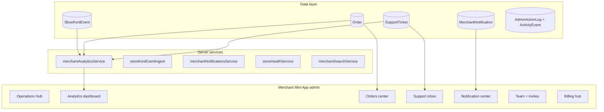

# Operations Platform — Audit & Architecture

> **Goal:** Commerce operating platform inside Telegram — merchant feels "I run a business", not "I use a bot".  
> **Constraint:** Mobile-first, compact, touch-friendly — NOT desktop CRM.

---

## 1. Current state audit

### What exists (foundation)

| Domain | Status | Key paths |
|--------|--------|-----------|
| Orders admin | Basic list + status + 3s poll | `AdminOrdersPage`, `GET/PUT /orders` |
| Analytics | Order-only KPIs + revenue chart | `AdminAnalyticsPage`, `POST /analytics` |
| Support | Tickets + returns, no inbox UX | `AdminSupportPage`, `supportRoutes.ts` |
| Staff RBAC | OWNER/ADMIN + 6 permissions | `AdminUsersPage`, `Membership` |
| Billing | Finik + manual + PlatformPage | `saasBillingService`, `PlatformPage` |
| Notifications | Telegram only, order dot | `orderTelegramNotify`, `App.tsx` attention |
| Audit | Write-only, 2 action types | `AdminActionLog` |
| Visitors | Client sessionStorage only | `commerceSession.ts` — not on server |

### Critical gaps

1. **No server-side audience/visitor analytics** — conversion impossible
2. **Analytics = raw order SQL in monolith** — no AOV, repeat rate, funnel
3. **Support = list/detail, not inbox** — no unread, queues, pinned
4. **No notification center** — fragmented Telegram pings
5. **Orders center** — no search, filters, timeline, notes, bulk
6. **No activity feed** — audit log not exposed
7. **No store health score** — webhook/subscription/support siloed
8. **No global search** — orders/products/customers/support
9. **Staff** — no invites, no username display in API

---

## 2. Target architecture (platform layers)

---

## 3. Domain maps

### 3.1 Analytics dashboard (mobile-native)

**Tabs (Phase 1–3):**

| Tab | Metrics |
|-----|---------|
| **Обзор** | Revenue, orders, AOV, conversion, chart revenue+orders |
| **Аудитория** | Visitors, DAU/WAU, returning customers, engagement |
| **Заказы** | Status funnel, top products, payment mix |
| **Поддержка** | Open tickets, resolution rate, returns |
| **Магазин** | Store health score, webhook, bot status |

**Data sources:**

- Orders → revenue, AOV, repeat buyers, top SKU
- `StorefrontEvent` → visitors, conversion, DAU/WAU
- `SupportTicket` → support analytics
- `Business` + webhook check → health score (Phase 4)

### 3.2 Audience system

Replace buyer "Users" concept with **Аудитория**:

- `STORE_VIEW` — storefront open
- `PRODUCT_VIEW` — product detail
- `ADD_TO_CART` — cart add
- `CHECKOUT_START` — checkout page

Visitor key: hashed Telegram ID or anonymous session ID.

### 3.3 Orders center (Phase 2)

- Grouped by status tabs
- Search: name, phone, order #
- Customer mini-card (name, phone, tg link — no raw ID in UI)
- Timeline: status changes (needs `OrderEvent` table Phase 2)
- Quick actions swipe/buttons
- Internal notes (`Order.internalNote` Phase 2)

### 3.4 Support inbox (Phase 2)

- Queue: open / pending / closed
- Unread badge per ticket (`lastReadAt` staff)
- Pinned tickets
- Canned replies (Phase 3)
- Return/dispute workflows (partial exists)

### 3.5 Notification center (Phase 1 foundation)

`MerchantNotification` kinds:

- ORDER_NEW, SUPPORT_MESSAGE, SUBSCRIPTION_EXPIRING, WEBHOOK_FAILED, PAYMENT_ISSUE, SYSTEM

In-app bell in admin shell + mark read.

### 3.6 Activity feed (Phase 3)

Extend `AdminActionType` + new `MerchantActivityEvent` for:

- Order status changes
- Staff permission changes
- Support actions
- Settings changes

### 3.7 Staff collaboration (Phase 3)

- Invite by `@username` → pending membership
- Roles: owner, manager, support-only, analytics-only (permission presets)
- Activity visibility per role

### 3.8 Billing hub (Phase 4)

- Plans, trial, invoices list, usage limits
- Upgrade/downgrade flows in PlatformPage redesign

### 3.9 Automation foundation (Phase 5)

- Event triggers → rules engine (auto-reply, cart nudge, onboarding)
- Stored as `AutomationRule` (future)

### 3.10 Global search (Phase 3)

- Single search bar → orders | products | support | customers
- Server: `merchantSearchService` unified query

---

## 4. Phased roadmap

### Phase 0 — Audit & architecture ✅ (this document)

### Phase 1 — Analytics + audience + notifications foundation (current PR)

- [x] `StorefrontEvent` + `MerchantNotification` schema
- [x] `merchantAnalyticsService` — AOV, conversion, DAU, repeat customers, support stats
- [x] Storefront event ingest API + client tracking
- [x] Notification create on new order + list/mark-read API
- [x] Redesigned `AdminAnalyticsPage` — tabbed mobile dashboard
- [x] Admin notification bell (unread count)

### Phase 2 — Orders center + Support inbox

- Order filters, search, status tabs, customer cards
- Support unread, queues, pinned
- Telegram notify on support reply (staff + customer)

### Phase 3 — Activity feed + staff invites + global search

- Activity timeline UI
- Invite flow
- Search bar

### Phase 4 — Billing hub + store health score

- Health score algorithm
- Billing UX redesign
- Platform monitoring dashboard (operator)

### Phase 5 — Automation foundation

- Rule schema + 2–3 built-in automations

---

## 5. Design consistency (operations UI)

Reuse storefront tokens where possible:

- `adminOperations.css` — compact KPI cards, tab bar, touch targets 44px
- Same motion tokens (`--sf-motion-*`)
- Sheets for detail views, not full page modals
- No desktop multi-column layouts

---

## 6. API index (Phase 1)

| Method | Path | Purpose |
|--------|------|---------|
| POST | `/analytics` | Extended merchant analytics |
| POST | `/api/storefront/events` | Batch event ingest (tenant header) |
| GET | `/merchant/notifications` | List + unreadCount |
| POST | `/merchant/notifications/read-all` | Mark all read |
| POST | `/merchant/notifications/:id/read` | Mark one read |

---

## 7. Non-goals (this phase)

- Full orders center redesign
- Support inbox redesign
- Billing invoices UI
- Automation engine
- Operator platform monitoring UI

These are Phase 2–5 per roadmap above.
