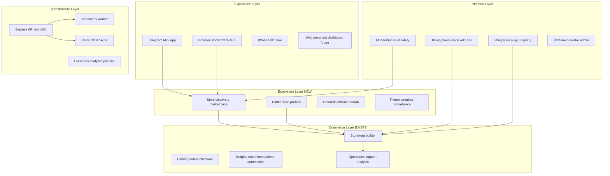
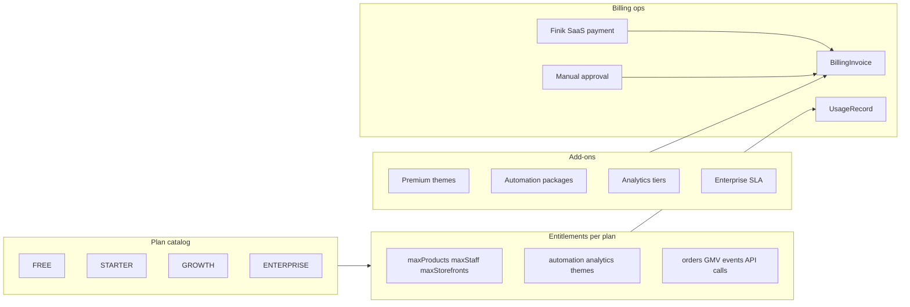
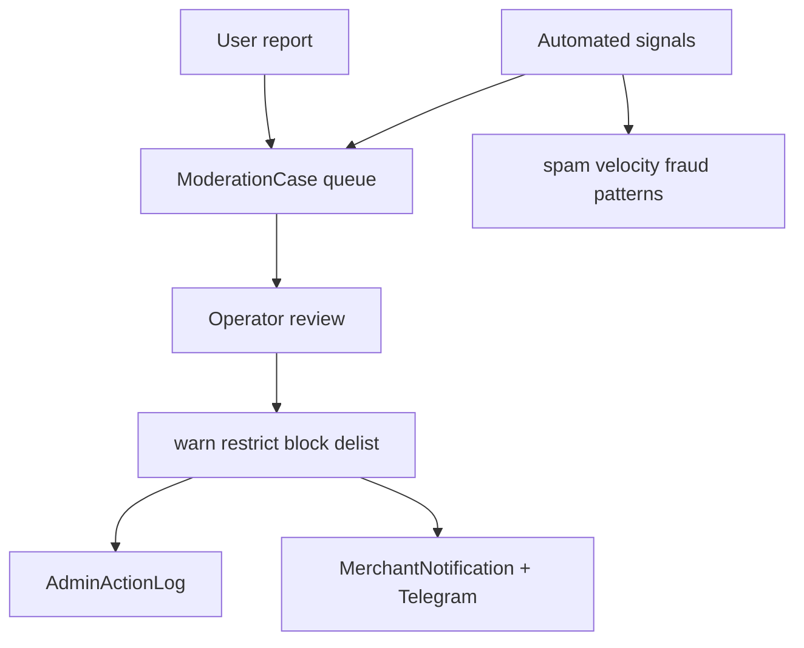

# Platform Scale + Ecosystem + Marketplace Evolution — Architecture

> **Philosophy:** Not a “Telegram shop builder” — a **Telegram-native commerce ecosystem platform**.  
> **Merchant feeling:** «Мой магазин — часть сети», not «я один на острове».  
> **Constraint:** Long-term evolution — no chaotic feature creep. Schema-first, API-second, UI-third.

---

## 1. Current state audit (post AI Commerce Phase 1)

### Strong foundation (already shipped)

| Layer | Maturity | Key paths |
|-------|----------|-----------|
| Multi-tenant core | **High** | `Business`, `Membership`, `User`, tenant header |
| Storefront + builder | **High** | `StorefrontConfig`, builder API, `AdminDesignPage` |
| Public slug routing | **Medium** | `Business.slug`, `/s/:slug`, `GET /api/storefront/by-slug/:slug` |
| SaaS billing (trial + Finik) | **Medium** | `saasBillingService`, `SubscriptionFinikPayment`, `PlatformPage` |
| Platform admin API | **High** | `/api/platform/admin/*`, operator sessions |
| Merchant RBAC | **Medium** | `MembershipRole`, 6 permissions, `AdminUsersPage` |
| Operations + analytics | **Medium** | `StorefrontEvent`, `merchantAnalyticsService`, Operations UI |
| Intelligent commerce (Tier 1) | **Medium** | insights, co-purchase, support suggestions, growth score |
| Support + returns | **Medium** | `supportRoutes`, tickets, merchant notifications |
| Rate limiting | **Low–medium** | `apiRateLimits.ts`, webhook gate |
| In-memory cache | **Low** | `storefrontCache.ts` (60s TTL, single process) |
| Automation schema | **Stub** | `AutomationRule` — no runner yet |

### Critical ecosystem gaps

| # | User goal | Gap today |
|---|-----------|-----------|
| 1 | Marketplace ecosystem | Stores are isolated; no cross-store discovery |
| 2 | Public store profiles | Slug + theme exist; no profile card / SEO / share metadata |
| 3 | Store discovery | No search stores, trending shops, category hubs |
| 4 | Commerce network | No referrals, affiliates, shared campaigns |
| 5 | Advanced billing | `BillingPlan` enum unused; no usage metering or add-ons |
| 6 | Plugin architecture | Finik hardcoded; no integration registry |
| 7 | Multi-store | `Storefront` model exists; runtime = 1 storefront per business |
| 8 | Enterprise | No invites, hierarchy, department roles, audit API |
| 9 | Moderation | `isBlocked` only; no reports queue |
| 10 | Async infra | All sync Express; no queue, webhook retry worker |
| 11 | Customer accounts | Orders-only; no profile, favorites, addresses |
| 12 | Loyalty | None |
| 13 | Cross-platform | TG Mini App + browser store; no PWA |
| 14 | Merchant growth tools | Growth score exists; no campaign center |
| 15 | Commerce intelligence | Phase 1 rules; no behavioral cohorts at platform level |
| 16 | Design ecosystem | Code-deployed templates; no theme marketplace |
| 17 | Brand maturity | Mixed identity; no unified platform design system |
| 18–19 | Scale | Monolith OK for 10–100 stores; not ready for 1000+ / multi-region |

---

## 2. Target platform layers



**Principle:** Ecosystem layer **indexes and links** stores — it does not duplicate catalog/checkout logic per store.

---

## 3. Scalability map

### Current bottlenecks (measured risk)

| Workload | Today | Risk at 500+ stores | Phase 2+ fix |
|----------|-------|---------------------|--------------|
| Analytics | Full order scan per request | DB CPU, slow dashboards | Daily aggregates table + materialized views |
| Storefront public payload | DB + 60s in-memory cache | Cache miss storm on deploy | Redis + CDN for static assets |
| Event ingest | Sync `createMany` | Write amplification | Batch queue, partition by `businessId` |
| Notifications | Sync insert per event | Merchant inbox lag | Dedupe + digest worker |
| Recommendations | On-demand SQL co-purchase | Repeated heavy joins | Nightly pair matrix per tenant |
| Webhooks (Telegram/Finik) | Inline handler | Timeouts, lost retries | Outbox + exponential retry |
| Platform discover | N/A | N/A | Read replica + search index |
| Image delivery | Cloudinary direct | Bandwidth cost | Transform presets + lazy load |

### Scale tiers (design targets)

| Tier | Stores | Architecture |
|------|--------|--------------|
| **T0** (now) | 1–100 | Single Render/Vercel, Postgres, sync handlers |
| **T1** | 100–1k | Redis cache, job worker process, daily analytics rollup |
| **T2** | 1k–10k | Read replica, Elasticsearch/Meilisearch for discover, event pipeline |
| **T3** | 10k+ | Multi-region CDN, sharded events, dedicated billing worker |

### Async job taxonomy (planned)

| Job kind | Trigger | Priority |
|----------|---------|----------|
| `analytics.rollup.daily` | Cron | P2 |
| `recommendations.rebuild` | Cron / order | P2 |
| `notification.digest` | Cron | P2 |
| `webhook.retry` | Failed delivery | P0 |
| `automation.run` | Event / cron | P1 |
| `moderation.scan` | Report / ML rules | P1 |
| `billing.usage.snapshot` | Cron | P1 |
| `discover.index.update` | Store publish | P2 |

**Schema stub (Phase 1):** `JobOutbox` — `kind`, `payload`, `status`, `attempts`, `nextRunAt`, `lastError`.

---

## 4. Billing architecture

### Current model

```
Business
├── subscriptionStatus: TRIALING | ACTIVE | PAST_DUE | CANCELED | EXPIRED
├── billingPlan: FREE | STARTER | GROWTH | ENTERPRISE  (mostly unset)
├── trialEndsAt / subscriptionEndsAt
├── Finik keys (merchant checkout — separate from SaaS)
└── PaymentRequest (manual screenshot) + SubscriptionFinikPayment (SaaS)
```

**Prices (hardcoded):** 20d / 30d / 90d via `SAAS_SUBSCRIPTION_PRICE_*` in `saasBillingService.ts`.

### Target billing model



### Plan entitlements (recommended defaults)

| Plan | Products | Staff | Storefronts | Automations | Analytics | Themes |
|------|----------|-------|-------------|-------------|-----------|--------|
| FREE | 25 | 1 | 1 | 0 | Basic | Built-in |
| STARTER | 100 | 3 | 1 | 3 | Standard | +2 premium |
| GROWTH | 500 | 10 | 3 | 20 | Advanced | All premium |
| ENTERPRISE | ∞ | ∞ | ∞ | ∞ | Full + export | Custom + marketplace |

### Enforcement points (where limits apply)

1. `POST /products` — product count
2. `POST /api/merchant/memberships` — staff count
3. `POST /api/merchant/storefronts` — storefront count (future)
4. `AutomationRule` create — automation count
5. Analytics export / long range — plan gate
6. Theme install from marketplace — add-on gate

### New schema (Phase 1 billing foundation)

```prisma
model PlanEntitlement {
  plan       BillingPlan @id
  limits     Json        // { maxProducts, maxStaff, ... }
  features   Json        // { automation: true, ... }
}

model UsageRecord {
  id           Int      @id @default(autoincrement())
  businessId   Int
  metric       String   // orders | gmv | events | api_calls
  quantity     Int
  periodStart  DateTime
  periodEnd    DateTime
  @@unique([businessId, metric, periodStart])
}

model BillingInvoice {
  id         Int      @id @default(autoincrement())
  businessId Int
  amountSom  Int
  status     String   // PENDING | PAID | FAILED
  source     String   // finik | manual
  plan       BillingPlan?
  addonKey   String?
  paidAt     DateTime?
  createdAt  DateTime @default(now())
}
```

### API (Phase 1)

- `GET /api/platform/billing/status` — plan, limits, usage snapshot, renewal date
- `GET /api/platform/billing/invoices` — merchant invoice history
- Internal: `assertPlanLimit(businessId, metric)` middleware helper

**Rule:** Billing changes never break existing paid merchants — grandfather via `Business.merchantConfig.billingGrandfather`.

---

## 5. Moderation architecture

### Current trust & safety

| Control | Scope | Path |
|---------|-------|------|
| `Business.isBlocked` | Platform ban | `adminBlockBusiness` |
| `Business.isActive` | Merchant self-disable | `toggle-bot` |
| `RegistrationRequest` | Onboarding gate | approve/reject |
| Subscription expiry | Soft lock messaging | `subscriptionAccess` |
| Rate limits | API abuse | `apiRateLimits` |

### Target moderation system



### Report types

| Target | Reporter | Examples |
|--------|----------|----------|
| `STORE` | Buyer / merchant | Scam, counterfeit, misleading |
| `PRODUCT` | Buyer | Prohibited goods |
| `ORDER` | Buyer / merchant | Non-delivery dispute escalation |
| `SUPPORT` | Either | Harassment |
| `REVIEW` | Buyer / merchant | Fake review (future) |

### Automated signals (rule-based, Phase 2)

- Order velocity spike + high cancel rate
- Identical product spam across new stores
- Webhook / payment failure patterns (`WEBHOOK_FAILED` notification kind)
- Support ticket abuse (same user, N tickets / hour)

### Schema (Phase 1 moderation foundation)

```prisma
enum ModerationReportStatus {
  OPEN
  UNDER_REVIEW
  RESOLVED
  DISMISSED
}

enum ModerationTargetType {
  STORE
  PRODUCT
  ORDER
  SUPPORT
  REVIEW
}

model ModerationReport {
  id              Int @id @default(autoincrement())
  targetType      ModerationTargetType
  targetId        Int
  businessId      Int?
  reporterUserId  Int?
  reason          String
  details         String?
  status          ModerationReportStatus @default(OPEN)
  resolvedAt      DateTime?
  resolvedBy      String?  // operator telegram id
  resolution      String?
  createdAt       DateTime @default(now())
  @@index([status, createdAt])
  @@index([businessId])
}

model PlatformStoreListing {
  businessId    Int      @id
  slug          String   @unique
  displayName   String
  tagline       String?
  logoUrl       String?
  businessType  BusinessType
  isPublic      Boolean  @default(false)
  isFeatured    Boolean  @default(false)
  featuredRank  Int?
  delistedAt    DateTime?  // moderation delist without full block
  publishedAt   DateTime?
  updatedAt     DateTime @updatedAt
}
```

**Link:** `isPublic` + `delistedAt` gate inclusion in discover API. `isBlocked` remains hard ban.

### API (Phase 1)

- `POST /api/platform/reports` — create report (authenticated)
- `GET /api/platform/admin/reports?status=OPEN` — operator queue
- `POST /api/platform/admin/reports/:id/resolve` — resolve + audit log
- Extend `AdminActionType`: `BLOCK_SHOP`, `UNBLOCK_SHOP`, `DELIST_STORE`, `FEATURE_STORE`

---

## 6. Marketplace & discovery architecture

### Isolated today vs ecosystem tomorrow

**Today:** Discovery = within-store rails (`discoveryFeedRegistry`, co-purchase API).  
**Tomorrow:** Platform directory indexes **published, public** stores.

### Discovery surfaces

| Surface | Data source | UX home |
|---------|-------------|---------|
| Featured stores | `PlatformStoreListing.isFeatured` | Platform home / marketplace tab |
| Category hubs | `businessType` + curated collections | `/discover/clothing` |
| Trending stores | Platform-level `StorefrontEvent` aggregates | Rank by DAU / orders |
| Search | Meilisearch on name, tagline, type | `?q=` |
| Recommended | Rule-based: type affinity, geo (future) | Personalization lite |
| Nearby | Lat/lng on `Settings` (future) | Geo filter |

### Public store profile (lightweight card)

Distinct from full storefront payload:

```typescript
type PublicStoreProfile = {
  slug: string;
  displayName: string;
  tagline?: string;
  logoUrl?: string;
  businessType: string;
  featured: boolean;
  openUrl: string;        // /s/{slug}
  miniAppUrl: string;     // t.me/bot?startapp=...
  stats?: {               // optional social proof
    productCount: number;
    // orderCount only if merchant opts in
  };
};
```

**API:** `GET /api/platform/discover/stores/:slug` — profile card  
**API:** `GET /api/platform/discover/stores?featured=&category=&q=&limit=`

### Category hubs (Phase 2)

```prisma
model DiscoverCollection {
  id          Int    @id @default(autoincrement())
  slug        String @unique
  title       String
  description String?
  storeIds    Int[]  // ordered businessIds
  isActive    Boolean @default(true)
}
```

### Storefront network effects

1. **Publish → index:** On `storefrontPublishedAt`, upsert `PlatformStoreListing` (opt-in `isPublic`)
2. **Featured rotation:** Operator sets `featuredRank`
3. **Cross-store collections:** Curated bundles (Phase 3)
4. **Referral links:** `?ref=storeSlug` attribution cookie (Phase 3)

---

## 7. Commerce network layer (Phase 3+)

| Capability | Schema sketch | Notes |
|------------|---------------|-------|
| Referrals | `ReferralLink { code, businessId, rewardConfig }` | Buyer + merchant rewards |
| Affiliate store links | `AffiliatePartner { businessId, partnerId, commissionPct }` | B2B |
| Shared campaigns | `Campaign` + `CampaignParticipant[]` | Cross-store promo (extends AI commerce campaigns) |
| Merchant collab | `StoreCollaboration { storeA, storeB, type }` | Bundle rails |
| Invite system | `StaffInvite` (enterprise) + `MerchantReferral` (growth) | Separate concerns |

**Rule:** Network features are **opt-in** per merchant — no forced cross-linking.

---

## 8. Multi-store management

### Current reality

- `Business` = tenant (billing, bot, Finik)
- `Storefront` table exists with optional `slug` — **not used for routing**
- Config duplicated: `Business.storefrontPublishedConfig` AND `Storefront.publishedConfig`
- Merchant switcher = **multiple businesses** (`GET /api/platform/my-businesses`), not multiple storefronts

### Target model

```
Merchant account (User)
└── Membership[] → Business (tenant)
    ├── Billing (one subscription per business)
    ├── Bot + Finik
    └── Storefront[] (1..N by plan)
        ├── slug (unique globally or scoped)
        ├── publishedConfig (SoT)
        └── analytics slice
```

### Migration path

1. **Phase 1:** `Storefront.publishedConfig` becomes SoT; deprecate `Business.storefrontPublished*`
2. **Phase 2:** `GET /api/storefront/by-slug/:slug` resolves `Business.slug` OR `Storefront.slug`
3. **Phase 3:** Merchant UI storefront switcher; centralized analytics rollup

### API (Phase 2)

- `GET /api/merchant/storefronts`
- `POST /api/merchant/storefronts`
- `PUT /api/merchant/storefronts/:id/publish`
- `GET /api/merchant/analytics/consolidated` — all storefronts under business

---

## 9. Enterprise architecture

### Current RBAC

| Role | Scope |
|------|-------|
| `OWNER` | Full tenant |
| `ADMIN` | Configurable 6 permissions |
| `CLIENT` | Buyer (membership exists, limited UX) |

### Enterprise extensions (Phase 4)

| Feature | Implementation |
|---------|----------------|
| Staff hierarchy | `Membership.parentId`, `department` field |
| Custom roles | `RoleTemplate` + permission sets |
| Invites | `StaffInvite { token, email, role, expiresAt }` |
| Audit API | Expose `AdminActionLog` + new action types |
| Moderation layer | Store-level moderators (subset permissions) |
| SSO / API keys | Enterprise add-on (Phase 5) |

### Audit expansion

Current `AdminActionType`: `DELETE_SHOP | EXTEND_SUBSCRIPTION` only.

**Add:** `BLOCK_SHOP`, `APPROVE_REGISTRATION`, `CHANGE_PLAN`, `FEATURE_STORE`, `RESOLVE_REPORT`, `STAFF_INVITE`, `EXPORT_DATA`.

---

## 10. Plugin / extension architecture

**Anti-pattern:** Hardcoded Finik checks scattered in handlers.  
**Target:** Integration registry with adapter interface.

```typescript
interface IntegrationAdapter {
  key: string;
  scopes: string[];
  connect(businessId: number, config: unknown): Promise<void>;
  disconnect(businessId: number): Promise<void>;
  healthCheck(businessId: number): Promise<{ ok: boolean; message?: string }>;
}
```

### Schema

```prisma
model IntegrationDefinition {
  key         String @id  // finik | stripe | cdek | ...
  name        String
  category    String      // payment | delivery | crm
  scopes      String[]
  isActive    Boolean @default(true)
}

model BusinessIntegration {
  id              Int    @id @default(autoincrement())
  businessId      Int
  integrationKey  String
  status          String // connected | error | disconnected
  config          Json   @default("{}")  // encrypted secrets server-side
  connectedAt     DateTime?
  @@unique([businessId, integrationKey])
}
```

### Seed integrations

1. `finik` — payment (existing)
2. `manual_payment` — screenshot flow
3. Future: `cdek`, `yandex_delivery`, `amocrm`, `webhook_out`

### API

- `GET /api/merchant/integrations` — catalog + connection status
- `POST /api/merchant/integrations/:key/connect`
- `DELETE /api/merchant/integrations/:key`

**Rule:** Checkout calls `getPaymentAdapter(businessId)` — never `if (finikApiKey)` in order handler.

---

## 11. Customer accounts & loyalty (Phase 3–4)

### Customer profile (extends global `User`)

```prisma
model CustomerProfile {
  userId         Int    @id
  defaultPhone   String?
  defaultAddress Json?
  favorites      CustomerFavorite[]
  loyaltyAccount LoyaltyAccount?
}

model CustomerFavorite {
  userId     Int
  businessId Int
  productId  Int
  @@unique([userId, businessId, productId])
}
```

### Loyalty (Phase 4)

```prisma
model LoyaltyAccount {
  userId     Int
  businessId Int
  points     Int @default(0)
  tier       String @default("standard")
  @@unique([userId, businessId])
}
```

**API:** `GET/PUT /api/me/profile`, `GET/POST/DELETE /api/me/favorites`  
**Cross-store loyalty:** Platform-wide points = separate `PlatformLoyalty` (Phase 5, optional).

---

## 12. Cross-platform architecture

| Surface | Status | Path |
|---------|--------|------|
| Telegram Mini App | **Primary** | `telegramWebAppBootstrap`, initData auth |
| Browser storefront | **Supported** | `/s/:slug`, public APIs without TG |
| PWA | **Missing** | Need `manifest.json`, SW, install prompt |
| Web merchant dashboard | **Partial** | Admin works in TG WebView; no standalone login |
| Native wrappers | **Future** | Same API + deep links |

### Unified auth strategy

| Context | Auth |
|---------|------|
| TG Mini App | `x-telegram-init-data` |
| Browser store (buyer) | Optional TG login widget / guest checkout |
| Browser dashboard (merchant) | TG login + session cookie (Phase 3) |
| Platform discover | Public read; TG for actions |

### PWA Phase 2 checklist

- `frontend/public/manifest.json`
- Service worker: shell cache only (no offline checkout)
- `display: standalone`, theme color from platform brand

---

## 13. Design ecosystem & brand maturity (Phase 5)

### Theme marketplace model

```prisma
model ThemeListing {
  id          Int    @id @default(autoincrement())
  slug        String @unique
  name        String
  industry    BusinessType?
  priceSom    Int    @default(0)
  previewUrl  String?
  configSeed  Json
  author      String?
  isOfficial  Boolean @default(false)
}
```

**Flow:** Browse → preview → install copies `configSeed` → `storefrontDraftConfig` → merchant publish.

### Brand maturity workstream (parallel, non-blocking)

| Workstream | Deliverable |
|------------|-------------|
| Platform identity | Name, tagline, logo system |
| Visual system | Tokens, typography, motion (extend greenfield UI docs) |
| SaaS branding | PlatformPage, onboarding, billing emails |
| Operator branding | Admin panel chrome |
| Merchant branding | Storefront identity band, profile page |

**Doc reference:** `docs/greenfield-ui-stage1-tokens.md`, `docs/greenfield-ui-stages-2-6-roadmap.md`

---

## 14. Commerce intelligence at ecosystem level (Phase 4)

Extends AI Commerce Phase 1–3:

| Scope | Today | Ecosystem |
|-------|-------|-----------|
| Recommendations | Co-purchase per store | Cross-store “similar shops” |
| Insights | Per-merchant rules | Benchmark vs category median |
| Behavioral analytics | `StorefrontEvent` per tenant | Platform funnel: discover → store → checkout |
| Storefront adaptation | Client rails | Platform-driven featured placement |

**Event addition:** `PLATFORM_STORE_CLICK`, `DISCOVER_IMPRESSION` — new `PlatformEvent` table (partitioned by day).

---

## 15. Reliability & infrastructure checklist

| Item | Current | Target |
|------|---------|--------|
| Queue | None | `JobOutbox` + worker process on Render |
| Background jobs | Cron in main process (`subscriptionMaintenance`) | Dedicated worker dyno |
| Notification scaling | Sync insert | Batch + dedupe |
| Analytics scaling | Live SQL | Rollup tables |
| Image optimization | Cloudinary transforms | Preset sizes in card components |
| Caching | 60s in-memory Map | Redis for storefront + discover |
| Rate limiting | express-rate-limit | + per-tenant quotas on API |
| Webhook retry | None | Outbox with `attempts`, DLQ |
| Observability | console.error | Structured logs + error tracking (Sentry) |

### Webhook retry schema

```prisma
model WebhookDeliveryLog {
  id          Int      @id @default(autoincrement())
  kind        String   // finik | telegram_set
  payload     Json
  status      String
  attempts    Int      @default(0)
  nextRunAt   DateTime?
  lastError   String?
  createdAt   DateTime @default(now())
}
```

---

## 16. Phased roadmap

### Phase 0 — Architecture ✅ (this document)

- [x] Ecosystem architecture audit
- [x] Scalability map
- [x] Billing architecture
- [x] Moderation architecture
- [x] Marketplace / multi-store / plugin / loyalty designs

### Phase 1 — Platform primitives (schema + minimal APIs)

**Goal:** Unlock ecosystem without UI explosion.

- [ ] `PlatformStoreListing` + discover APIs (`/api/platform/discover/stores`)
- [ ] `PublicStoreProfile` payload + share metadata
- [ ] `ModerationReport` + admin queue API
- [ ] `PlanEntitlement` + `UsageRecord` + `GET /api/platform/billing/status`
- [ ] `IntegrationDefinition` + `BusinessIntegration` (Finik seed)
- [ ] `JobOutbox` schema (worker = Phase 2)
- [ ] Extend `AdminActionType` + audit log API
- [ ] Auto-upsert listing on storefront publish (opt-in `isPublic`)

### Phase 2 — Marketplace UX + infra worker

- [ ] Discover UI (platform home / marketplace tab)
- [ ] Featured + category hubs
- [ ] Job worker process (rollup, webhook retry)
- [ ] Redis cache layer
- [ ] Plan limit enforcement on create paths
- [ ] PWA manifest + shell SW

### Phase 3 — Network + customer layer

- [ ] Referrals + affiliate links
- [ ] Customer profile + favorites API + UI
- [ ] Campaign center (extends AI commerce campaigns)
- [ ] Multi-storefront CRUD + slug routing
- [ ] Store search (Meilisearch or PG trigram)

### Phase 4 — Enterprise + loyalty + intelligence

- [ ] Staff invites + custom roles
- [ ] Loyalty points + tiers
- [ ] Platform behavioral analytics
- [ ] Benchmark insights for merchants
- [ ] Theme marketplace (official themes first)

### Phase 5 — Brand + scale tier T2+

- [ ] Full platform rebrand
- [ ] Enterprise plans + SSO
- [ ] Multi-region / read replicas
- [ ] Community reviews + social proof (ties to AI commerce Phase 5)

---

## 17. Non-goals (avoid feature creep)

| Do NOT build yet | Why |
|------------------|-----|
| Full theme marketplace with payments | Needs billing add-ons + moderation first |
| Cross-store checkout (single cart) | Massive complexity; network = discovery first |
| Native mobile apps | PWA + TG sufficient for 12+ months |
| Crypto payments | Region-specific; Finik first |
| ML ranking for discover | Rule-based trending sufficient at T1 |
| DAO / token loyalty | Not aligned with KG commerce reality |
| Replacing Express monolith | Premature; extract workers first |

---

## 18. File index (planned)

| Concern | Path |
|---------|------|
| Discover service | `src/server/platformDiscoverService.ts` |
| Store listing sync | `src/server/platformStoreListingService.ts` |
| Billing entitlements | `src/server/billingEntitlementsService.ts` |
| Moderation | `src/server/moderationService.ts` |
| Integration registry | `src/server/integrationRegistry.ts` |
| Job outbox | `src/server/jobOutboxService.ts` |
| Discover UI | `frontend/src/pages/DiscoverPage.tsx` |
| Public profile | `frontend/src/pages/PublicStoreProfilePage.tsx` |
| Billing hub | extend `PlatformPage.tsx` |

---

## 19. Dependency on prior phases

| Prior work | Enables |
|------------|---------|
| Operations + `StorefrontEvent` | Trending stores, platform analytics |
| AI Commerce insights + growth | Merchant optimization score in ecosystem |
| AI Commerce recommendations | In-store rails; ecosystem adds cross-store |
| AutomationRule schema | Automation packages in billing add-ons |
| Slug storefront routing | Public profiles + discover links |

---

## 20. Success metrics (ecosystem health)

| Metric | Target (T1) |
|--------|-------------|
| Public listed stores | >30% of active merchants opt in |
| Discover → store click CTR | >5% |
| Cross-store return visits | Measurable via `PLATFORM_STORE_CLICK` |
| Report resolution time | <48h operator SLA |
| Billing plan adoption | >20% on paid plans |
| p95 storefront load | <800ms with Redis |

---

*Next step: Phase 1 implementation — `PlatformStoreListing` + discover API + moderation report schema. Say which slice to build first: **marketplace discover**, **billing limits**, or **moderation queue**.*
