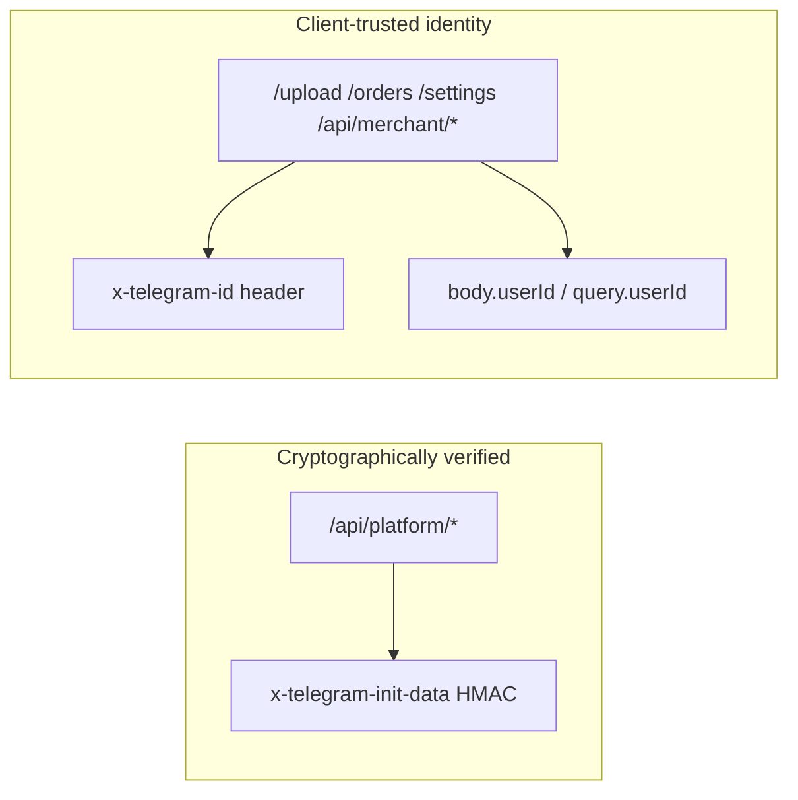

# Global Product Maturity + Platform Hardening — Audit & Roadmap

> **⚠️ Superseded in part by Phase 18 (2026-06):** See authoritative inventory at [`docs/security/phase-18-inventory.md`](./security/phase-18-inventory.md) and closeout at [`docs/security/phase-18-final-report.md`](./security/phase-18-final-report.md). Historical SEC-* IDs below are kept for traceability — do not delete.

> **Philosophy:** Not new features — **production-grade scalable commerce infrastructure**.  
> **Goal:** Remove the “quickly assembled project” feeling; one stable, mature platform.  
> **Constraint:** Audit first → hardening → unification → optimization → QA → polish.

---

## Executive summary

| Dimension | Maturity | Blocker for scale |
|-----------|----------|-------------------|
| Security / auth | **Medium–low** | Split auth model: platform routes verified, merchant routes spoofable |
| Technical debt | **Medium** | Monolith, dead code, dual CSS stacks, alert()-driven UX |
| Design system | **Medium** (storefront) / **Low** (admin) | Three token pipelines, no shared primitives |
| Mobile QA | **Partial** | Safe areas + scroll lock done; no formal device matrix |
| Commerce reliability | **Medium** | Order/payment flows work; polling races, no cart persist |
| Observability | **Low** | console.log only, no metrics, webhook body logging |
| Data consistency | **Medium** | Tenant-scoped queries mostly correct; client state gaps |
| Migration / rollout | **Low** | Prisma migrations only; no feature-flag rollout system |

**Highest-risk finding:** Merchant/admin APIs trust client-supplied `x-telegram-id` without Telegram `initData` verification. Platform routes under `/api/platform/*` are cryptographically authenticated; everything else is not.

---

## 1. Platform hardening audit

### 1.1 Auth model (split brain)



| Route family | Identity | File |
|--------------|----------|------|
| `/api/platform/*` | initData HMAC ✓ | `requireTelegramAuth.ts` |
| Merchant admin | `x-telegram-id` ✗ | `telegramIdFromRequest()` — `index.ts:2394` |
| `/api/*` tenant middleware | `x-telegram-id` ✗ | `business.middleware.ts` |
| Public catalog | None (by design) | `resolveCatalogBusinessId()` |

### 1.2 Critical / high security findings

| ID | Severity | Issue | Location |
|----|----------|-------|----------|
| SEC-01 | **Critical** | Spoofable merchant identity → full admin API access if attacker knows victim TG ID + shop ID | `telegramIdFromRequest`, all `requireMerchantStaff` routes |
| SEC-02 | **Critical** | `GET /my-businesses`, `GET /api/my-businesses` — enumerate businesses by `?telegramId=` with no auth | `index.ts:2903–2926` |
| SEC-03 | **High** | `check-webhook`, `toggle-bot` — operator by TG ID only, no unlock session | `platformMerchantBotControl.ts`, `index.ts:623–695` |
| SEC-04 | **High** | Platform operators access any store Finik/bot settings without unlock session | `platformMerchantAccess.ts`, `platformMerchantStoreSettings.ts` |
| SEC-05 | **High** | `/connect-bot` — bot token change with spoofable identity | `index.ts:2757–2823` |
| SEC-06 | **High** | Finik webhook signature skipped when env/header/secret missing | `finikMerchant.ts:verifyFinikWebhookSignature` |
| SEC-07 | **High** | Production auth bypass via `SKIP_TELEGRAM_WEBAPP_AUTH=1` | `requireTelegramAuth.ts:29–32`, `.env.example` |
| SEC-08 | **Medium** | `GET /api/platform/admin/whoami` leaks raw `telegramId` | `index.ts:307–317` |
| SEC-09 | **Medium** | Webhook handler logs full request body (PII) | `index.ts:2706` |
| SEC-10 | **Medium** | `POST /check-admin` — unauthenticated admin enumeration | `index.ts:2863–2900` |
| SEC-11 | **Medium** | CORS `origin: *` on API | `index.ts` CORS config |
| SEC-12 | **Medium** | ADMIN with empty `permissions[]` grants all 6 perms | `merchantPermissions.ts:29–32` |
| SEC-13 | **Low** | Legacy webhook paths expose numeric `businessId` | `/telegram-webhook/owner/:businessId` |

### 1.3 RBAC & operator permissions

**What works:**
- `MembershipRole` OWNER / ADMIN / CLIENT
- 6 merchant permissions via `MERCHANT_PERM` + `effectiveMerchantPermissions`
- Operator unlock: bcrypt password, session token, sliding TTL, reauth for destructive ops — `platformOperatorAuth.ts`
- Destructive `/api/platform/admin/*` routes require unlock + reauth

**Gaps:**
- Operator-capable routes outside admin prefix lack unlock gate (SEC-03, SEC-04)
- No staff invite flow — manual membership only
- No permission audit trail exposed to merchants
- `AdminActionType` only 2 values — insufficient for security maturity

### 1.4 Tenant isolation

**What works:**
- Order creation validates cart items match resolved shop (`index.ts:4266–4312`)
- Product fetch checks `businessId` match
- Theme update checks `req.businessId !== bid`
- Support tickets scoped by `businessId`

**Gaps:**
- Tenant chosen by client hint (`x-business-id`, `?shop`) without binding to verified identity
- Combined with SEC-01 → cross-tenant impersonation as merchant staff

### 1.5 Webhook security & rate limiting

| Surface | Protection | Gap |
|---------|------------|-----|
| Telegram webhook | Secret header, constant-time compare, per-IP RPS | Body logging; legacy paths |
| Finik webhook | Optional HMAC | Skipped when misconfigured; no rate limit on `/finik/webhook/:id` |
| API general | 60/min per IP | `trustProxy: false` vs `app.set("trust proxy", 1)` |
| Platform sensitive | 10/min strict | No per-account lockout on operator password |

### 1.6 Input validation & uploads

**Good:** Zod on platform bodies, `StorefrontConfigSchema`, order phone validation, promo reconciliation.

**Gaps:** Most merchant routes use `req.body as { ... }` casting; upload MIME-only (no magic bytes); support upload weaker than merchant upload.

### Hardening target state

```
All privileged routes → verified Telegram identity (initData or server session derived from initData)
Tenant context → bound to verified membership, not client header alone
Operator actions → unlock session required (no TG-ID-only bypass)
Webhooks → signature required in production (fail startup if missing)
Uploads → magic-byte validation + size caps + auth
```

---

## 2. Technical debt map

### 2.1 Architecture debt

| Item | Impact | Path |
|------|--------|------|
| Monolithic server | Hard to test, review, scale | `index.ts` ~4776 lines |
| Dual auth models | Security hole | See §1 |
| Dual storefront config SoT | Desync risk | `Business.storefrontPublishedConfig` vs `Storefront.publishedConfig` |
| Dual navigation | Back button bugs | React Router + `App.tsx` page state |
| CustomEvent bus | Hidden coupling | `sf:productSheetOpen`, `miniapp:admin-orders-changed` |
| Window alerts | Blocks UI, bad a11y | 30+ `alert()` calls across admin/checkout |

### 2.2 Dead code (safe to remove)

| File | Reason |
|------|--------|
| `ProductDetailModal.tsx` + CSS | Replaced by `ProductDetailSheet` |
| `DiscoveryRails.tsx` | Unused; logic in `discoveryFeedRegistry.ts` |
| `Layout.tsx` + `layout.css` | Never imported |
| `Toast.tsx` + CSS | Never wired; noop `showToast` |
| `HomePage.css` | Orphan stylesheet |
| `adminAuth.ts` `denyIfNotAdmin` | Unused legacy |

### 2.3 Temporary fixes still in production

| Fix | Location | Replace with |
|-----|----------|--------------|
| Global CSS load order war | `main.tsx` loads bones last | Scoped tokens per surface |
| Finik dual polling | `App.tsx` 3s + `PaymentProcessingBanner` 1.5s | Single payment state machine |
| Analytics silent `.catch(() => [])` | `merchantAnalyticsService.ts` | Log + metric for degradation |
| `#${productId}` fallback names | `recommendationsService.ts` | Always resolve product name |
| Dev `?shop=ID` in customer errors | `App.tsx`, `CheckoutPage` | Human copy only |

### 2.4 Debug / immature UI copy

| Issue | Where |
|-------|-------|
| Raw product IDs in design editor | `AdminDesignPage.tsx` |
| `?shop=id_магазина` in promo errors | `CheckoutPage.tsx` |
| Telegram IDs in admin order cards | Partially fixed; verify remaining |
| `INCOMING:` log every request | `index.ts:293` |

---

## 3. Consistency map — design system

### 3.1 Three parallel styling systems

| System | Tokens | Surfaces |
|--------|--------|----------|
| Legacy store | `--store-*` | `ThemeContext`, old pages |
| Storefront DS | `--sf-*` | `storefrontBones`, `commerceShell`, feed/cards |
| Admin legacy | `--admin-*` | `Admin.css` (~2k lines) + `adminOperations.css` |

**Reference:** `docs/greenfield-ui-stage1-tokens.md` — target: single token pipeline per surface via `data-surface` attribute.

### 3.2 Component inconsistency matrix

| Primitive | Storefront | Admin | Checkout | Target |
|-----------|------------|-------|----------|--------|
| Buttons | `sf-btn-*` | `admin-order-card__btn` | `checkout-btn` | `<Button variant>` |
| Sheets | `ProductDetailSheet` | — | — | Unified sheet primitive |
| Cards | `ProductCard` + sf cards | `admin-kpi-card` | — | Shared card tokens |
| Errors | Banner (checkout partial) | `setError` + alert | alert() | `<InlineAlert>` + recovery |
| Loading | Skeleton in storefront | `Загрузка…` text | Mixed | `<LoadingState>` |
| Toast | Dead code | alert() | — | Single feedback layer |

### 3.3 Motion & touch

**Done:** `bodyScrollLock.ts`, `motionTokens.css`, sticky cart hide on sheet, safe-area in ops CSS.

**Missing:** Unified touch target min 44px audit; sheet gesture parity on Android WebView; landscape/tablet layouts untested.

### Unification roadmap (design)

1. **Phase A:** `data-surface` scoping + remove `--store-*` globals
2. **Phase B:** Primitives — `Button`, `Sheet`, `InlineAlert`, `LoadingState`
3. **Phase C:** Admin token alignment with ops CSS as base
4. **Phase D:** Motion tokens applied to admin transitions

---

## 4. Mobile QA matrix (Telegram Mini App)

### 4.1 Test matrix (required before “mature” sign-off)

| Environment | Priority | Focus areas |
|-------------|----------|-------------|
| iOS Telegram | P0 | Safe area, sheet scroll, keyboard over inputs |
| Android Telegram | P0 | WebView quirks, back gesture vs sheet |
| Telegram Desktop | P1 | Narrow window, mouse vs touch |
| Mobile browser `/s/:slug` | P1 | Public storefront without TG chrome |
| Landscape phone | P2 | Header overlap, sticky cart |
| Tablet | P2 | Grid breakpoints, admin ops tabs |

### 4.2 Known mobile risk areas

| Area | Risk | File |
|------|------|------|
| Checkout address + keyboard | Input hidden under keyboard | `CheckoutPage.tsx` |
| Product sheet | Scroll lock edge cases | `ProductDetailSheet.tsx` |
| Admin support grid | Small screens two-column | `AdminSupportPage` |
| Floating cart drag | Touch conflict with scroll | `FloatingCart.tsx` |
| Side menu | Body scroll lock migration | `Header.tsx`, `SideMenu` |
| Finik external link | Return to Mini App | `openTelegramExternalLink` |

### 4.3 QA deliverable

Create `docs/mobile-qa-checklist.md` (Phase 2) with pass/fail per screen × device. No automated mobile tests today.

---

## 5. Stability & reliability

### 5.1 Race conditions & async flows

| Flow | Issue | Severity |
|------|-------|------------|
| Finik payment | Dual pollers; 30min silent timeout | High |
| Cart + tenant switch | Clears without warning; no persist | Medium |
| Admin orders poll | 3s poll + event reload overlap | Low |
| Storefront payload | Cache 60s vs publish invalidation | Low |
| Checkout double-submit | Button disable only | Medium |

### 5.2 Session restoration

| State | Storage | Restored on refresh? |
|-------|---------|----------------------|
| Tenant shop | sessionStorage + URL | ✓ |
| Cart | memory only | ✗ |
| Commerce session (views) | sessionStorage | ✓ |
| Analytics visitor key | sessionStorage | ✓ |
| Finik pending order | localStorage | ✓ (partial UX) |
| Admin selected tab | sessionStorage (support) | Partial |

### 5.3 Reconnect / retry

| Client | Retry | Gap |
|--------|-------|-----|
| `storefrontAnalytics` | Fire-and-forget | Failures swallowed |
| Admin API | Manual page reload | No auto-retry banner |
| Checkout order POST | User must retry | No idempotency key |

---

## 6. Commerce reliability

### 6.1 Lifecycle audit

| Lifecycle | Status | Gaps |
|-----------|--------|------|
| Order | Status machine enforced server-side | Client poll-only updates |
| Payment (Finik) | Webhook + poll | Signature optional; timeout UX |
| Payment (manual) | Screenshot upload | MIME-only validation |
| Support ticket | Full CRUD | Customer identity spoofable |
| Return | Linked to ticket | Merchant notification wired |
| Promo | Server reconcile on checkout | Client error paths use alert |
| Inventory | No stock field on Product | N/A until inventory phase |
| Analytics | Event ingest + order aggregates | Full table scans |

### 6.2 Consistency rules (target invariants)

1. **Order total** = server-computed from cart + promo; client display is hint only
2. **Ticket** always belongs to `(businessId, userId, orderId?)` — never cross-tenant
3. **Subscription** state on `Business` is SoT; `isActive` separate from subscription
4. **Published storefront** = `storefrontPublishedAt` + config SoT (needs unification)
5. **Notifications** — idempotent create for same event (dedupe window)

---

## 7. Error UX maturity

### 7.1 Current patterns

| Pattern | Usage | Maturity |
|---------|-------|----------|
| `apiErrorHandler` generic message | Server | Good |
| `setError("Не удалось…")` | Admin pages | Good |
| `alert(e.message)` | Checkout, admin, support | **Poor** |
| Staged loading messages | Storefront payload | Good |
| Recovery actions | Rare | **Missing** |
| Offline detection | None | **Missing** |

### 7.2 Target error UX model

```typescript
type UserFacingError = {
  title: string;           // human, Russian
  body?: string;
  recovery?: "retry" | "refresh" | "contact_support" | "open_telegram";
  technicalCode?: string;  // logged server-side only
};
```

**Rules:**
- Never show stack traces, HTTP status, or raw `e.message` to merchants/customers
- Every blocking error offers one recovery action
- Network failures → retry banner with exponential backoff
- Payment failures → link to support + order ID (not internal IDs)

---

## 8. Platform observability

### 8.1 Current state

| Capability | Status |
|------------|--------|
| Structured logs | ✗ console.log/warn/error |
| Request correlation ID | ✗ |
| Performance metrics | ✗ |
| Error tracking (Sentry) | ✗ |
| Health check endpoint | Partial (implicit) |
| Webhook delivery log | Schema kind exists; no table |
| Queue monitoring | ✗ |
| Storefront health score | Growth service only |

### 8.2 Target observability stack (Phase 2–3)

| Layer | Tool / pattern |
|-------|----------------|
| HTTP | pino JSON logs + `x-request-id` |
| Errors | Sentry (frontend + backend) |
| Metrics | Prometheus or Render metrics — request latency, error rate, webhook failures |
| Alerts | Operator Telegram on webhook failure spike, subscription job failure |
| Dashboard | Storefront p95 load, analytics query time, notification backlog |

### 8.3 Log redaction rules

- Never log: webhook bodies, initData, bot tokens, Finik secrets, full phone numbers
- Always log: requestId, businessId, route, durationMs, error code

---

## 9. Data consistency review

| Domain | SoT | Client cache | Desync risk |
|--------|-----|--------------|-------------|
| Products | Postgres | Storefront payload 60s | Low |
| Cart | Zustand memory | None | **High** on refresh |
| Orders | Postgres | Poll in App | Medium |
| Memberships | Postgres | Admin fetch | Low |
| Subscriptions | Business row | PlatformPage | Low |
| Support | Postgres | Per-ticket fetch | Low |
| Analytics events | Postgres | Client batch queue | Medium (drops) |
| Notifications | Postgres | Bell poll | Low |
| Storefront config | Business + Storefront duplicate | Client | **Medium** |

**Action:** Pick single config SoT; cart persist per tenant in sessionStorage; analytics ingest ack + retry.

---

## 10. Migration & rollout architecture

### 10.1 Current

- Prisma migrations in `prisma/migrations/` — manual `migrate deploy` on Render
- `Business.featureFlags` JSON — ad hoc, no registry
- No blue/green; no staged rollout

### 10.2 Target

```prisma
// Platform-level flags (future)
model FeatureFlag {
  key         String @id
  enabled     Boolean @default(false)
  rolloutPct  Int     @default(0)  // 0-100
  allowList   Int[]   @default([]) // businessIds
}
```

**Rollout rules:**
1. Schema migration → deploy API → deploy frontend (backward compatible API)
2. New UI behind `featureFlags` or platform flag
3. Data backfill scripts in `scripts/migrations/` with idempotent runs
4. Breaking changes require 2-phase deploy (read old + write new)

---

## 11. UX consistency — “one product” test

| Surface | Feels like | Gap to unified |
|---------|------------|----------------|
| Storefront | Premium mobile commerce | Reference surface |
| Admin ops | Improved but distinct CSS | Align tokens + components |
| Support admin | Functional grid | Different spacing/buttons |
| Onboarding / Platform | SaaS wizard | Different typography |
| Operator panel | Embedded in PlatformPage | No dedicated operator chrome |
| Checkout | Legacy buttons | Migrate to sf primitives |

**North star:** User cannot tell storefront vs admin were built at different times.

---

## 12. Performance optimization map

### 12.1 Frontend hotspots

| Hotspot | Cause | Fix |
|---------|-------|-----|
| ProductCard re-renders | Subscribes to full cart | Selector by productId |
| Discovery feed rebuild | sessionRev rebuilds all blocks | Memoize rails |
| App.tsx ResizeObserver | Sticky cart measurement | CSS-only where possible |
| Large catalog | No virtualization | Virtual list Phase 3 |
| Image delivery | Full-size URLs | Cloudinary transforms preset |

### 12.2 Backend hotspots

| Hotspot | Cause | Fix |
|---------|-------|-----|
| `buildMerchantAnalytics` | Loads all orders + events | Daily rollup table |
| Co-purchase SQL | 90d order items in memory | Nightly pair cache |
| Storefront public payload | Multiple DB round-trips | Single query + Redis |
| `index.ts` cold start | Large module | Route splitting |

---

## 13. Scalability readiness (hardening lens)

| Load | Ready? | Hardening needed |
|------|--------|------------------|
| 100 merchants | ✓ | Auth fix P0 |
| 1000 merchants | Partial | Analytics aggregation, Redis cache |
| Traffic spikes | Partial | Rate limits exist; no autoscale story |
| Support volume | Partial | Sync notifications |
| Storage (images) | ✓ Cloudinary | Transform presets |
| Webhook bursts | Weak | Queue + retry |

Cross-ref: `docs/platform-ecosystem-architecture.md` §3 Scalability map.

---

## 14. Security maturity roadmap

| Capability | Today | Phase 2 |
|------------|-------|---------|
| Audit trails | Write-only, 2 types | Expand + merchant read API |
| Operator event history | Partial logs | Structured audit table |
| Permission audit | None | Log permission changes |
| Login history | None | initData auth sessions table |
| Suspicious activity | Rate limit only | Velocity rules on orders/reports |
| Brute-force protection | IP rate limit | Operator lockout + CAPTCHA |
| Secure recovery | Manual Telegram | Documented operator runbook |

---

## 15. Developer experience

| Area | State | Improvement |
|------|-------|-------------|
| Folder structure | Server monolith | Split `src/server/routes/` |
| Naming | Mixed EN/RU comments | EN code, RU user strings via i18n |
| API contracts | Partial TS types | OpenAPI or shared zod schemas |
| Env handling | `.env.example` good | Startup validation (fail fast prod) |
| Documentation | 9 architecture docs | Add `CONTRIBUTING.md`, runbook |
| Shared utilities | Some duplication | Extract `auth/`, `validation/` modules |

---

## 16. Product polish checklist (final pass)

- [ ] No raw Telegram IDs in customer UI
- [ ] No raw product/order IDs in merchant UI (use names/labels)
- [ ] No `alert()` in production paths
- [ ] No debug query hints (`?shop=`) in user errors
- [ ] All empty states have illustration + action
- [ ] Loading states consistent (`Загрузка…` — one spelling)
- [ ] i18n: all user strings through `ru.ts` or CMS text config
- [ ] Placeholder lorem removed
- [ ] Favicon + page titles per surface

---

## 17. Long-term foundation (no new features — prepare)

| Future capability | Hardening prerequisite |
|-------------------|------------------------|
| Mobile apps | Unified auth session API |
| External integrations | Plugin registry + webhook outbox |
| AI layers | Validated config pipeline (already started) |
| Ecosystem marketplace | Auth + moderation + public listing hardening |
| Enterprise | Audit + RBAC + multi-store SoT |

---

## 18. Phased execution plan

### Phase 0 — Audit ✅ (this document)

- [x] Architecture audit
- [x] Technical debt map
- [x] Consistency map
- [x] Security review
- [x] UX inconsistency review

### Phase 1 — Security hardening (P0, ~1–2 weeks)

**No new features. Fix bypasses.**

- [ ] Unified auth middleware for all merchant routes (initData or session)
- [ ] Remove/gate unauthenticated `/my-businesses` enumeration
- [ ] Operator unlock on `check-webhook`, `toggle-bot`, platform store settings
- [ ] Production startup guards (`SKIP_TELEGRAM_WEBAPP_AUTH`, Finik signature)
- [ ] Remove webhook body logging
- [ ] Fix ADMIN empty-permissions default → least privilege
- [ ] Gate `/test-telegram`, `/connect-bot`

### Phase 2 — Stability & error UX (~2 weeks)

- [ ] Cart persist per tenant (sessionStorage)
- [ ] Single Finik payment state machine + timeout UX
- [ ] Replace `alert()` with `InlineAlert` on checkout + top 5 admin pages
- [ ] Human-friendly error mapping (`ru.ts` error keys)
- [ ] Analytics ingest retry + drop metric
- [ ] Idempotency key on order create

### Phase 3 — Cleanup & unification (~2–3 weeks)

- [ ] Delete dead code (modal, rails, layout, toast)
- [ ] `data-surface` token scoping (Stage 1 tokens doc)
- [ ] Shared UI primitives (Button, Sheet, Alert, Loading)
- [ ] Split `index.ts` into route modules
- [ ] Structured logging (pino) + request ID
- [ ] Storefront config single SoT

### Phase 4 — Performance & observability (~2 weeks)

- [ ] ProductCard cart selector optimization
- [ ] Analytics SQL aggregation (rollup table)
- [ ] Co-purchase cache / precompute
- [ ] Sentry integration
- [ ] Health + metrics endpoints

### Phase 5 — Mobile QA & polish (~2 weeks)

- [ ] Execute mobile QA matrix (iOS/Android/Desktop)
- [ ] Fix all P0/P1 mobile issues
- [ ] Full i18n sweep
- [ ] Empty states + copy polish
- [ ] Product maturity sign-off checklist (§16)

---

## 19. Non-goals (this phase)

| Skip | Reason |
|------|--------|
| Marketplace / discover UI | Ecosystem phase — after hardening |
| Loyalty / points | Feature creep |
| New admin features | Maturity phase only |
| Theme marketplace | Design ecosystem — later |
| Microservices split | Premature; modular monolith first |
| Native apps | After auth session API stable |

---

## 20. Cross-document index

| Doc | Relationship |
|-----|--------------|
| `operations-platform-architecture.md` | Ops UI — unify in Phase 3 |
| `ai-commerce-platform-architecture.md` | Intelligence — needs observability |
| `platform-ecosystem-architecture.md` | Ecosystem — blocked on SEC-01 fix |
| `greenfield-ui-stage1-tokens.md` | Design unification blueprint |
| `product-polish-audit-roadmap.md` | Overlaps — superseded by this for maturity |
| `frontend-api-inventory.md` | API contract reference |

---

## 21. Success criteria — “mature platform”

| Metric | Target |
|--------|--------|
| Critical security findings | 0 open |
| `alert()` in user paths | 0 |
| Dead code files (listed §2.2) | Removed |
| Mobile QA P0 cases | 100% pass iOS + Android |
| Analytics p95 (30d range) | < 2s |
| Storefront p95 TTFB | < 500ms cached |
| Error rate (5xx) | < 0.1% |
| Cart abandonment from refresh | Measurable ↓ after persist |

---

*Next step: **Phase 1 Security Hardening** — unified auth middleware. This is the highest-leverage work before any ecosystem or marketplace features.*
