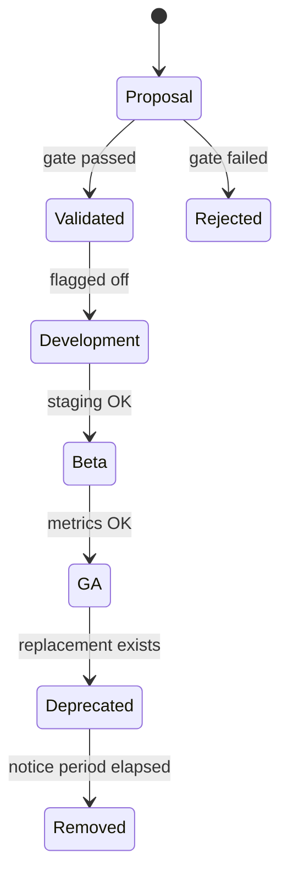

# Product Governance

> **Purpose:** Prevent chaotic feature creep; ensure every change has a lifecycle, owner, and exit strategy.  
> **Applies to:** All platform work after Long-Term Evolution Phase 0.

---

## 1. Governance principles

| Principle | Meaning |
|-----------|---------|
| **Merchant outcomes first** | Feature must improve retention, GMV, or trust — not “because we can” |
| **Schema before UI** | Data model + API contract before screens |
| **Flags before GA** | New behavior ships dark → beta → GA |
| **Deprecate loudly** | Nothing removed without notice and metric check |
| **Simplicity wins** | Default “no” until validation passes innovation gate |

---

## 2. Roadmap discipline

### 2.1 Horizon buckets

| Horizon | Time | Content |
|---------|------|---------|
| **Now** | Current sprint | Max 3 engineering initiatives |
| **Next** | 1–2 months | Validated, scoped, flagged |
| **Later** | 3–6 months | Strategy doc only — no code |
| **Never** | — | Explicit non-goals list |

### 2.2 Roadmap sources (priority order)

1. Merchant feedback (`ProductFeedback`, support tickets)  
2. Funnel drop-offs (`PlatformFunnelEvent`)  
3. Operator observations (beta cohort)  
4. Strategic docs (brand, ecosystem, monetization)  
5. Internal tech debt (security, scalability P0)  

**Rule:** P0 security/stability items **preempt** feature work.

### 2.3 Quarterly review agenda

- [ ] Retention + churn cohort review  
- [ ] Infra cost vs MRR  
- [ ] Deprecation candidates  
- [ ] Non-goals reaffirmation  
- [ ] Roadmap re-bucket (Now / Next / Later)  

---

## 3. Feature prioritization (RICE-lite)

Score each proposal 1–5:

| Factor | Question |
|--------|----------|
| **Reach** | How many merchants affected? |
| **Impact** | GMV / retention / trust impact? |
| **Confidence** | Evidence from feedback or data? |
| **Effort** | Engineering + ops weeks? |

**Priority = (Reach × Impact × Confidence) / Effort**

Minimum bar for **Now**:

- Confidence ≥ 3 (not pure speculation)  
- Scalability review done (see scalability review)  
- UX impact ≤ medium OR explicit polish sprint  

---

## 4. Controlled innovation gate

**No new system** unless checklist complete:

| # | Gate | Owner |
|---|------|-------|
| 1 | Problem statement + merchant quote or metric | Product |
| 2 | Non-goals / scope boundary written | Product |
| 3 | Schema or API sketch reviewed | Engineering |
| 4 | Scalability note (T0/T1 OK?) | Engineering |
| 5 | Feature flag plan | Engineering |
| 6 | Rollback plan | Engineering |
| 7 | Docs stub (merchant or operator) | Docs |
| 8 | Beta cohort size defined | Operator |

**Exceptions:** P0 security fixes, production outages.

---

## 5. Feature lifecycle

| Stage | Criteria to enter | Criteria to exit |
|-------|-------------------|------------------|
| **Proposal** | Idea documented | Gate checklist started |
| **Validated** | Gate 1–4 done | Flag implemented |
| **Development** | Behind flag | Staging smoke pass |
| **Beta** | 5–20 merchants or cohort | No P1 bugs 14d |
| **GA** | Default on | — |
| **Deprecated** | Successor live | Usage < 5% |
| **Removed** | 30–90d notice | Zero critical deps |

---

## 6. Deprecation strategy

### 6.1 Process

1. Announce in merchant notification + changelog  
2. Log deprecated API usage  
3. Set `Deprecation: true` header (API) or in-app banner (UI)  
4. Remove only after notice period + metric threshold  

### 6.2 Current deprecation candidates

| Item | Replace with | Earliest removal |
|------|--------------|------------------|
| `--store-*` CSS vars | `--sf-*` per surface | After greenfield Stage 1 |
| `x-telegram-id` auth | initData middleware | After unified auth GA |
| `GET /my-businesses?telegramId=` | Authenticated platform API | After SEC-02 fix |
| `alert()` UX | InlineAlert / toast | Gradual |

---

## 7. Migration strategy (product + data)

| Type | Policy |
|------|--------|
| **Schema** | Prisma migrations only; expand-contract for breaking |
| **Config** | Version field in JSON configs; resolver handles N-1 |
| **Feature flags** | Default false; per-tenant opt-in for beta |
| **Merchant comms** | Breaking changes → 7d notice minimum |

---

## 8. Rollout strategy

| Rollout type | When | Mechanism |
|--------------|------|-----------|
| **Dark launch** | Internal/staging | Flag off in prod |
| **Cohort beta** | Risky UX | `Business.featureFlags.betaCohort` |
| **Percentage** | Large surface | Hash `businessId % 100` < N |
| **GA** | Proven | Flip platform flag default |

**Always:** Ability to disable without redeploy (flag or env).

---

## 9. What we do NOT build (living non-goals)

Synced with [long-term-platform-evolution.md](./long-term-platform-evolution.md):

- Cross-store unified cart  
- Native iOS/Android apps (12+ mo)  
- Crypto payments  
- ML ranking v1  
- Microservices split  
- Open theme upload without moderation  
- Enterprise SSO before unified auth  

**Adding to non-goals requires quarterly review approval.**

---

## 10. Roles & ownership

| Area | Owner | Artifact |
|------|-------|----------|
| Roadmap | Founder/product | Quarterly doc |
| Release | Engineering | `release-checklist.md` |
| Beta cohort | Operator | Runbook + funnel |
| Security | Engineering | Maturity audit P0 |
| Docs | Shared | `docs/README.md` hub |
| Incidents | Operator + engineering | Runbook § incidents |

---

## 11. UX refinement cycles (not rewrites)

| Cadence | Activity |
|---------|----------|
| **Weekly** | Review feedback + top 3 UX papercuts |
| **Bi-weekly release** | Ship 1–3 polish items max |
| **Monthly** | Consistency pass one surface (admin OR platform OR checkout) |
| **Quarterly** | No giant rewrite — audit only |

**Feedback sources:** `ProductFeedback`, support tags, funnel drops, operator notes.

---

## 12. Merchant trust governance

| Commitment | Implementation |
|------------|----------------|
| Billing clarity | Show plan, renewal date, what’s included |
| Transparent limits | Before block, show upgrade path |
| Audit trails | Extend `AdminActionType`; merchant-visible log (Phase 2) |
| Secure actions | Unified auth; reauth for destructive ops |
| Reliability | `/ready`, status comms during incidents |

---

## 13. Data governance (summary)

| Data class | Retention | Integrity |
|------------|-----------|-----------|
| Orders | Indefinite | Transactional — source of truth |
| StorefrontEvent | 12 mo raw → rollup | Append-only |
| Support tickets | 24 mo | Immutable messages |
| Audit logs | 24 mo | Operator actions |
| Feedback | 12 mo | Anonymize optional |
| Funnel events | 12 mo | Aggregate for dashboards |

Detail: implement retention jobs in Phase 2 worker.

---

## Related docs

- [Long-Term Platform Evolution](./long-term-platform-evolution.md)
- [Release Review](./reviews/release-review.md)
- [Architecture Review](./reviews/architecture-review.md)
