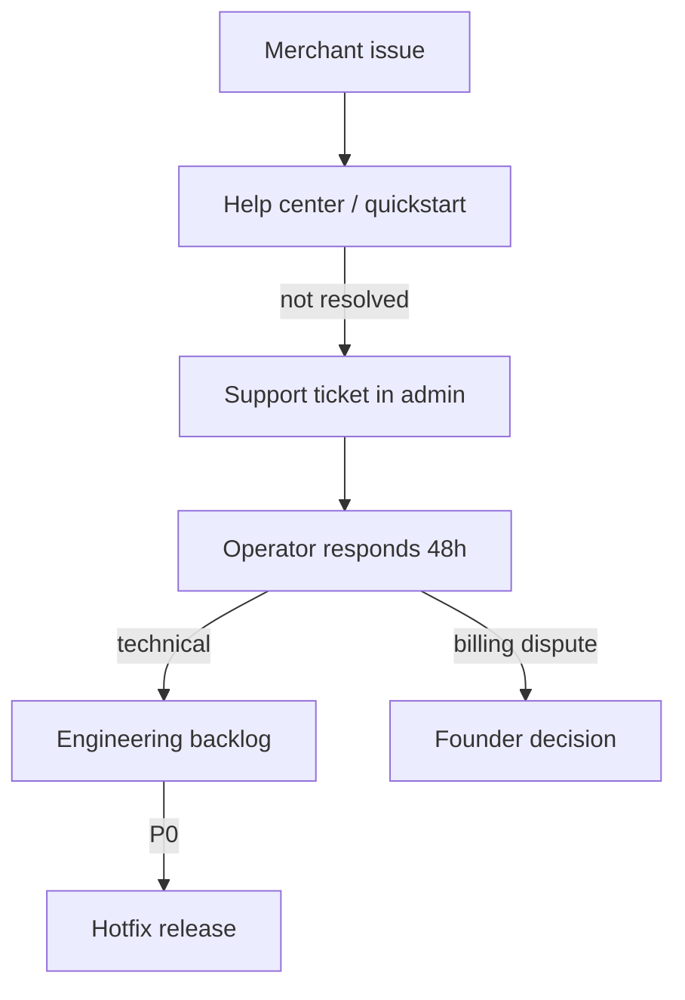

# Product Operating Model

> **Purpose:** Replace founder chaos with **repeatable rhythms** — releases, triage, support, incidents.

---

## 1. Operating philosophy

| Old mode | New mode |
|----------|----------|
| Urgent fix driven | Scheduled rhythm + severity gates |
| Founder decides everything | Operator owns day-to-day |
| Ship when ready | Ship on bi-weekly train (exceptions: hotfix) |
| Docs afterthought | Doc update part of “done” |
| Build features | Improve metrics |

---

## 2. Roles (RACI)

| Activity | Operator | Founder/Product | Engineering |
|----------|----------|-----------------|-------------|
| Approve/reject registration | **R/A** | I | I |
| Block/disable merchant | **R/A** | I | C |
| Feedback triage | **R** | A | C |
| Roadmap Now (max 3) | C | **A/R** | C |
| Production deploy | C | A | **R** |
| Hotfix / rollback | I | A | **R** |
| Security P0 | I | A | **R** |
| Funnel weekly review | **R** | A | I |
| Pricing change | C | **A/R** | C |
| Featured discover | **R** | A | I |

*R=Responsible, A=Accountable, C=Consulted, I=Informed*

---

## 3. Release cycles

| Type | Cadence | Contents | Gate |
|------|---------|----------|------|
| **Hotfix** | As needed | P0/P1 bug, security | Smoke on prod or staging |
| **Minor** | Bi-weekly (Wed) | Polish, gated features, docs | Staging smoke + checklist |
| **Major** | Quarterly | Breaking changes, deprecations | Beta cohort 14d |

### Release train checklist

1. `npm run check`  
2. Staging deploy + smoke (when staging exists)  
3. `release-checklist.md`  
4. Tag git `vYYYY.MM.DD`  
5. 24h log watch assigned  
6. Release note in `docs/changelog.md` (one paragraph)  

**Deploy freeze:** Fri 16:00+ Bishkek except hotfix.

---

## 4. Roadmap process

### Bi-weekly (30 min)

1. Review [roadmap.md](./roadmap.md)  
2. Check funnel + feedback for new inputs  
3. Re-score top backlog (RICE)  
4. Confirm max **3 Now** items  
5. Move items between Now / Next / Later / Never  

### Quarterly (2 h)

- Retention cohort  
- Infra cost vs revenue  
- Non-goals reaffirmation ([platform-vision.md](./platform-vision.md))  
- Complexity audit refresh  

---

## 5. Bug triage system

### Severity

| Level | Definition | Response |
|-------|------------|----------|
| **P0** | Platform down, payments broken, data loss | Immediate hotfix |
| **P1** | Major flow broken for many merchants | Same day |
| **P2** | Workaround exists | Next minor release |
| **P3** | Cosmetic / edge case | Backlog |

### Triage workflow (weekly Mon, 30 min)

1. Pull open `ProductFeedback` + Sentry (when live)  
2. Assign P0–P3  
3. P0/P1 → Now if not already  
4. Close duplicates → `wontfix` with reason  
5. Update roadmap  

### Feedback status flow

`open` → `triaged` → `scheduled` → `closed` | `wontfix`

---

## 6. Feature prioritization (operational)

Use [product-governance.md](./product-governance.md) innovation gate + RICE.

**Hard rules:**

- No new subsystem without one-page decision doc  
- No “Now” item without success metric  
- Security P0 preempts all  
- Complexity budget: 3 Now max  

---

## 7. Support escalation flow

| Channel | SLA |
|---------|-----|
| Registration approve | 48 h |
| Operator feedback response | 5 business days |
| P0 incident | 15 min acknowledge |
| P1 bug fix target | 24 h |

---

## 8. Incident handling flow

See [guides/incident-response.md](./guides/incident-response.md).

| Phase | Actions |
|-------|---------|
| **Detect** | Uptime alert, user report, 5xx spike |
| **Triage** | S0–S3 classify |
| **Mitigate** | Rollback / flag off / comms |
| **Resolve** | Fix forward |
| **Learn** | Post-incident note in `docs/incidents/` |

---

## 9. Continuous refinement mode

**After operating model is live:**

| Cadence | Max scope |
|---------|-----------|
| Weekly | 0–1 UX papercut |
| Bi-weekly release | 1–3 polish items |
| Monthly | One surface consistency pass |
| Quarterly | Audit only — no rewrite |

**Forbidden:** Multi-week UI rewrites without metric justification.

---

## 10. Sustainable scaling triggers

| Signal | Action |
|--------|--------|
| > 50 active merchants | Operator part-time formalized |
| > 10 support tickets/week | Help center + FAQ |
| > 5 registration/day | Approve SLA + template responses |
| > 100 orders/day | Worker process + rollups |
| Founder > 10h/week ops | Delegate operator tasks |

---

## Related docs

- [Founder Exit Operating Mode](./founder-exit-product-operating-mode.md)
- [Governance Audit](./audits/governance-audit.md)
- [Operational Audit](./audits/operational-audit.md)
- [Release Checklist](./release-checklist.md)
