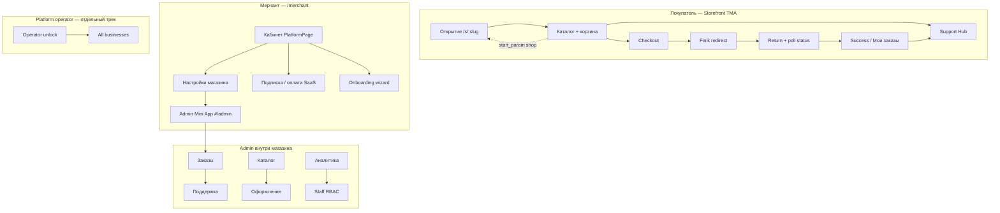

# Product Polish + UX Stabilization — Audit, UX Map, Roadmap

> **Scope:** Telegram Mini App commerce UX (не operator security — отдельный трек).  
> **Date:** 2026-05-21  
> **Principle:** поэтапно, без хаотичных фиксов; каждая фаза — mergeable increment.

---

## 1. Executive summary

| Area | Current state | Production gap |
|------|---------------|----------------|
| i18n | ~95% RU inline; pockets EN in PlatformPage, badges, admin enums | Mixed RU/EN; no unified layer |
| Checkout | Finik-only; form-like UX; bugs in redirect/cart | Weak confidence flow; «Оплатить» confusion |
| Touch/scroll | body scroll + conflicting nested scroll + ad-hoc body lock | Critical TMA issue (swipe-close, admin scroll) |
| Cleanup | Hard delete orders (admin); no archive | Needs soft-delete + support cleanup |
| Users admin | «Пользователи» = staff RBAC | Need «Аудитория» analytics, not buyers list |
| Telegram IDs | Shown in AdminUsersPage | Must be server-only |
| Registration | Dual path: bot wizard + Mini App form | Bot chat registration should be deprecated |
| Business bots | Order inline keyboards in Telegram | Should be informational + Mini App entry only |
| Promo codes | Backend + checkout OK; admin UI orphaned | Wire PromoCodesPanel + full engine |

---

## 2. UX map (user journeys)



### Screen inventory

| Surface | Route / entry | Primary files |
|---------|---------------|-----------------|
| Storefront home | `App` page=home | `HomePage`, `StorefrontFeed`, `ProductGrid` |
| Cart | page=cart | `CartPage`, `StickyCartBar`, `useCartStore` |
| Checkout | page=checkout | `CheckoutPage`, `MapPicker` |
| My orders | page=my-orders | `MyOrders` |
| Support | page=support | `SupportHubPage` |
| Store admin | `#/admin/*` | `AdminApp`, `Admin*Page` |
| Merchant cabinet | `/merchant` | `PlatformPage`, `MerchantDashboardPage` |
| Registration | `/merchant/register` | `MerchantRegisterPage` |
| Registration bot | Telegram DM | `saasRegistration.ts`, `registrationBotAdminPanel.ts` |

---

## 3. Detailed audit by workstream

### 3.1 Русификация (i18n)

**Current:**
- `frontend/src/i18n/ru.ts` — 25 keys, 2 consumers
- `storefrontTextConfig` — merchant-editable copy (8 files duplicate `readTxt`)
- Hardcoded strings in 50+ TSX files

**English / mixed hotspots (priority):**

| Priority | File | Examples |
|----------|------|----------|
| P0 | `PlatformPage.tsx` | Trial, Active, Operator Mode, Webhook OK |
| P0 | `AdminSupportPage.tsx` | OPEN, PENDING_CUSTOMER, raw enums |
| P1 | `badgeEngine.ts` | NEW, SALE, HOT |
| P1 | `AdminUsersPage.tsx` | OWNER, ADMIN, CLIENT badges |
| P1 | `AdminDesignPage.tsx` | Fashion, template IDs |
| P2 | `index.html`, `brand.ts` | lang=en, Shop |
| P2 | FAQ fallbacks | "FAQ" |

**Target architecture:**

```
frontend/src/i18n/
  ru.ts              # all platform strings (namespaced)
  index.ts           # t('admin.orders.status.NEW'), plural helpers
  statusMaps.ts      # ORDER, TICKET, RETURN, SUBSCRIPTION enums → RU
  storefrontText.ts  # single readTxt(storefrontOverride?)
```

Merchant content (hero, FAQ items) stays in Design Studio / API — not platform i18n.

---

### 3.2 Checkout

**Flow today:** Cart → Checkout form → POST `/orders` → `paymentUrl` → `location.href` → poll in `App.tsx`.

**Known bugs:**

1. `window.location.href` instead of `Telegram.WebApp.openLink` — риск выхода из TMA
2. Cart cleared **before** redirect succeeds
3. `setSubmitting(false)` in `finally` even during redirect
4. No visible «processing payment» UI after return (silent poll)
5. Finik admin confirm vs auto-poll mismatch (`ACCEPTED` vs `CONFIRMED`)
6. Promo apply via raw `fetch` without auth headers
7. Dead CSS `.checkout-payment__opt*` (removed payment selector)
8. `PromoCodesPanel` / `PaymentDetailsPanel` not mounted in admin

**Target UX:**

- Mobile-first stepped checkout (contact → delivery → payment → confirm)
- Sticky bottom CTA with total + trust copy
- States: `idle | validating | creating | redirecting | awaiting_payment | success | error`
- Retry on error; disabled double-submit
- Success screen + order number
- Post-return banner on home while polling

---

### 3.3 Touch / scroll (CRITICAL)

**Root cause pattern:**
- Intended: single scroller = `document.body`
- Reality: nested `overflow-y: auto` in cart, product sheet, admin modals
- Body scroll lock: 4 independent `body.style.overflow` toggles (race on overlap)

**Affected files:**
- `index.css`, `app-shell.css`, `Cart.css`, `CheckoutPage.css`
- `SideMenu.tsx`, `Header.tsx`, `ProductDetailSheet.tsx`, `ProductDetailModal.tsx`
- `main.tsx` — no `expand()`, no `disableVerticalSwipes()`

**Fix plan (Phase A):**
- Central `bodyScrollLock.ts` (ref-count)
- `bootstrapTelegramWebApp()` on startup
- Remove nested scroll from cart list
- `overscroll-behavior-y: none` on fixed overlays; `contain` on body
- Admin: ensure `#/admin` uses body scroll, modals use inner scroll only

---

### 3.4 Manual cleanup

**Exists:**
- `AdminOrdersPage` → `DELETE /orders/clear?type=completed|rejected|all` (hard delete)
- Requires `orders.manage`

**Missing:**
- Soft delete / archive flag on `Order`, `SupportTicket`
- Support: «очистить закрытые обращения»
- Confirm modal with typed confirm for destructive bulk
- Owner-only for «удалить все»

---

### 3.5 Users → Audience / Analytics

**Today:**
- Nav «Пользователи» (`AdminUsersPage`) = staff membership (OWNER promotes ADMIN)
- Buyers only appear in orders/support
- `AdminAnalyticsPage` — basic KPIs, partially i18n

**Target:**
- Rename nav: **Команда** (staff) + **Аудитория** (visitors/traffic)
- New metrics: visitors graph, conversion, active users, orders chart
- Backend: need `StoreVisit` / analytics events (schema TBD)
- Invite flow: Telegram @username → membership (API extension)

---

### 3.6 Telegram IDs in UI

| Location | Fix |
|----------|-----|
| `AdminUsersPage` — `Telegram ${id}`, `id {id}` | Show `@username`, first_name, avatar only |
| `AdminOrdersPage` — tg:// link | Keep link, hide numeric id in label |
| Platform operator cards | Already flagged in security track |

---

### 3.7 Registration bot redesign

**Today:**
- Rich wizard in bot chat (`saasRegistration.ts`)
- Thin Mini App form (`MerchantRegisterPage`)
- Approval in bot admin panel, not Mini App operator UI

**Target:**
- Registration **only** in Mini App wizard (progress, autosave, validation)
- Bot: informational + deep link to Mini App
- Operator notifications: funnel events (opened, started, dropped, completed)
- New brand identity (name, colors) — design pass

---

### 3.8 Business bots simplification

**Today:** `bot.ts` — accept/cancel/confirm/ship/paid inline keyboards

**Target:**
- Bot messages: «Новый заказ #123» + button «Открыть в приложении»
- All order actions in `#/admin/orders`
- Keep: payment notifications to buyer, storefront `web_app` button

---

### 3.9 Promo engine

**Schema:** `Promo` (code, discount %, maxUses, used)

**Gaps:**
- No expiration, per-user limit, fixed amount type
- Admin UI not wired (`#/admin/settings` dead → redirects to design)
- No promo analytics

**Target:** extend schema + mount admin panel + checkout validation hardening

---

## 4. Phased implementation plan

### Phase 0 — Audit & foundation ✅ (this document)
- [x] Codebase audit
- [x] UX map
- [x] Prioritized roadmap

### Phase A — Touch/scroll stabilization (CRITICAL)
- [ ] `bodyScrollLock.ts` + migrate overlays
- [ ] `telegramWebAppBootstrap.ts` (ready, expand, disableVerticalSwipes)
- [ ] Cart/checkout scroll unification
- [ ] Admin scroll smoke test on iOS WebView

**Exit criteria:** admin orders page scrolls fully; swipe-up less likely to close TMA; no scroll lock races.

### Phase B — Checkout redesign + payment states
- [ ] Fix redirect (`openLink`), cart timing, submitting guard
- [ ] Sticky CTA + visual hierarchy
- [ ] Payment processing banner + success state
- [ ] Promo fetch via `api.post`
- [ ] Align Finik status UX with backend (document admin step if manual)

### Phase C — i18n layer + RU sweep
- [ ] Expand `i18n/` (t, statusMaps, namespaces)
- [ ] P0 files: PlatformPage, AdminSupport, badges
- [ ] `index.html` lang=ru

### Phase D — Admin product cleanup
- [ ] Wire `PromoCodesPanel` + settings route
- [ ] Order/support soft archive + confirm modals
- [ ] Hide Telegram IDs in admin UI
- [ ] Rename «Пользователи» → «Команда»

### Phase E — Analytics / audience
- [ ] Visit tracking schema + API
- [ ] Audience page (graphs, conversion)
- [ ] Enhance `AdminAnalyticsPage`

### Phase F — Registration & bots
- [ ] Mini App registration wizard v2
- [ ] Bot → informational only
- [ ] Operator funnel notifications
- [ ] Business bot order keyboard removal

### Phase G — Promo engine v2
- [ ] expiration, limits, fixed discount
- [ ] Admin CRUD + analytics

### Phase H — Brand identity
- [ ] Platform naming, color language, TMA-native visual system

---

## 5. Dependencies & risks

| Risk | Mitigation |
|------|------------|
| Finik manual confirm vs auto poll | Align backend webhook or adjust poll targets |
| i18n big-bang | Namespace migration file-by-file |
| Bot registration removal | Feature flag + grace period |
| Analytics needs new DB tables | Phase E separate migration |
| TMA API version (`disableVerticalSwipes`) | Graceful optional call |

---

## 6. Files reference (quick index)

| Domain | Key paths |
|--------|-----------|
| Checkout | `pages/CheckoutPage.tsx`, `App.tsx`, `pendingFinikOrder.ts` |
| Scroll | `index.css`, `app-shell.css`, `utils/bodyScrollLock.ts` |
| i18n | `i18n/ru.ts`, `i18n/index.ts` |
| Admin | `pages/admin/Admin*.tsx`, `components/ui/Admin.css` |
| Promo | `components/admin/PromoCodesPanel.tsx`, `server/promoRepo.ts` |
| Registration | `bot/saasRegistration.ts`, `pages/MerchantRegisterPage.tsx` |
| Orders bot | `bot/bot.ts`, `server/orderTelegramNotify.ts` |

---

## 7. Next action

**Start Phase A** (touch/scroll) — merged in same PR series as i18n foundation prep.  
**Then Phase B** (checkout) — highest user-visible impact after scroll fix.
