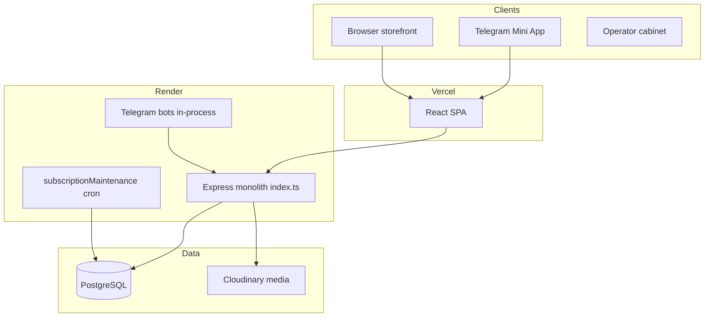

# Architecture Review

> **Phase:** Long-Term Platform Evolution — Review 1/4  
> **Date basis:** Codebase audit (May 2026)  
> **Scope:** System boundaries, consistency, contracts, state model

---

## 1. Executive summary

| Dimension | Grade | Summary |
|-----------|-------|---------|
| Domain model (Prisma) | **B+** | Rich, tenant-scoped, 26 migrations |
| API surface | **B** | ~100 routes; Zod on platform, casting elsewhere |
| Auth architecture | **D+** | Split brain: platform verified, merchant spoofable |
| Frontend architecture | **B-** | React SPA; dual navigation + triple CSS stacks |
| Storefront pipeline | **A-** | Strong schema-first (`resolveStorefrontConfig`) |
| Background processing | **C** | Cron in main process; no job queue |

**Primary risk:** Security and tenant binding are architectural, not cosmetic. Fixing SEC-01 changes how every merchant route works — do this before scaling merchant count.

---

## 2. System context



**Assessment:** Appropriate for current scale. Extract **workers** before extracting microservices.

---

## 3. Module boundaries (current vs target)

### 3.1 Server (`src/server/`)

| Module | Responsibility | Coupling issue |
|--------|----------------|----------------|
| `index.ts` | **Everything** (~4750 lines, ~100 routes) | God file — blocks reviews and testing |
| `platform*Service.ts` | Platform SaaS | Good separation |
| `merchant*Service.ts` | Merchant intelligence | Good separation |
| `supportRoutes.ts` | Support API | Partially extracted |
| `finikMerchant.ts` | Payments | OK |
| `storefrontPublicPayload.ts` | Public storefront | OK + cache layer |

**Target structure (Phase 1):**

```
src/server/
├── index.ts              # bootstrap, middleware, mount routers
├── routes/
│   ├── platform.routes.ts
│   ├── merchant.routes.ts
│   ├── storefront.routes.ts
│   ├── orders.routes.ts
│   ├── webhooks.routes.ts
│   └── admin.routes.ts
├── services/             # existing *Service files
└── middleware/           # existing
```

### 3.2 Storefront (`src/storefront/`)

| Strength | Notes |
|----------|-------|
| Single resolver | `schema.ts` → `resolveStorefrontConfig` |
| Wire validation | `storefrontPublicApiResponseSchema.ts` |
| Feature flags | `featureFlags.ts` — per-business JSON |

**Gap:** Dual SoT — `Business.storefrontPublishedConfig` vs `Storefront.publishedConfig`. Pick one canonical path; other becomes cache/legacy.

### 3.3 Frontend (`frontend/src/`)

| Area | Pattern | Issue |
|------|---------|-------|
| Storefront | Feed registry, commerce session | Solid |
| Admin | `admin.service.ts` monolith client | Large but workable |
| Platform | `platformApi.ts` | OK |
| Routing | React Router + legacy page state in `App.tsx` | Dual navigation |
| Styling | 3 token systems | See maintainability review |

---

## 4. API contract consistency

| Route family | Validation | Auth | Tenant binding |
|--------------|------------|------|----------------|
| `/api/platform/*` | Zod (`platformRouteBodySchemas`) | initData HMAC ✓ | Membership check ✓ |
| `/api/storefront/*` | Schema parse on output | Public read | `businessId` in path |
| `/merchant/*` | Partial | **x-telegram-id** ✗ | Header `x-business-id` ✗ |
| `/orders`, `/upload` | Cast bodies | **Spoofable** ✗ | Middleware hint ✗ |
| Webhooks | Secret/HMAC partial | N/A | businessId in path |

**Contract recommendation:**

1. All `/merchant/*` and tenant mutations → require verified initData  
2. Tenant context derived from `membership` lookup, not client headers alone  
3. Publish OpenAPI subset for `/api/storefront/*` + `/api/discover/*` (public contract)

---

## 5. State consistency

| Domain | Source of truth | Client cache | Gap |
|--------|-----------------|--------------|-----|
| Cart | Client Zustand | Session | No server cart — OK for v1 |
| Orders | PostgreSQL | Admin refetch | Polling races on payment |
| Storefront config | DB published config | 60s in-memory cache | Single-process cache only |
| Theme | DB + tokensV3 | Client CSS vars | Legacy `--store-*` leak |
| Subscription | `Business.subscriptionStatus` | PlatformPage | Finik async lag |

**Critical path:** Order + payment state machine should be single-owner (server authoritative; client subscribes).

---

## 6. Shared systems inventory

| System | Reuse | Action |
|--------|-------|--------|
| `requireTelegramAuth` | Platform only | Extend to merchant |
| `merchantPermissions.ts` | Server + client copy | Keep in sync; consider shared package |
| `envValidation.ts` | Boot only | Extend with staging profile |
| `storefrontCache.ts` | Single node | Redis or sticky sessions at scale |
| `apiRateLimits.ts` | Global IP | Add per-tenant quotas later |
| Feature flags | Storefront + `Business.featureFlags` | Central registry needed |

---

## 7. Architecture decisions to lock (ADR-style)

| ID | Decision | Rationale |
|----|----------|-----------|
| ADR-001 | Monolith + worker process (not microservices) | Team size, deploy simplicity |
| ADR-002 | initData auth for all privileged routes | Single identity model |
| ADR-003 | Schema-first storefront | Already proven |
| ADR-004 | PostgreSQL as analytics SoT (rollups later) | Avoid second DB until needed |
| ADR-005 | Feature flags before beta channels | Per-merchant rollout without env sprawl |
| ADR-006 | No cross-store cart | Discovery-only network effects |

---

## 8. Findings prioritized

| ID | Severity | Finding | Phase 1 action |
|----|----------|---------|----------------|
| ARCH-01 | P0 | Split auth model | Unified initData middleware |
| ARCH-02 | P0 | `index.ts` god file | Extract route modules |
| ARCH-03 | P1 | Dual storefront config SoT | Document + migrate path |
| ARCH-04 | P1 | Dual frontend navigation | Router-only navigation plan |
| ARCH-05 | P1 | No job queue | `JobOutbox` schema + worker |
| ARCH-06 | P2 | Client/server permission duplication | Shared types package |
| ARCH-07 | P2 | CustomEvent coupling | React context or query invalidation |

---

## 9. Non-goals (architecture)

- GraphQL layer  
- Event sourcing for orders  
- Multi-region active-active  
- Separate admin SPA repo  

---

## Related docs

- [Scalability Review](./scalability-review.md)
- [Platform Maturity Hardening Audit](../platform-maturity-hardening-audit.md)
- [Platform Ecosystem Architecture](../platform-ecosystem-architecture.md)
