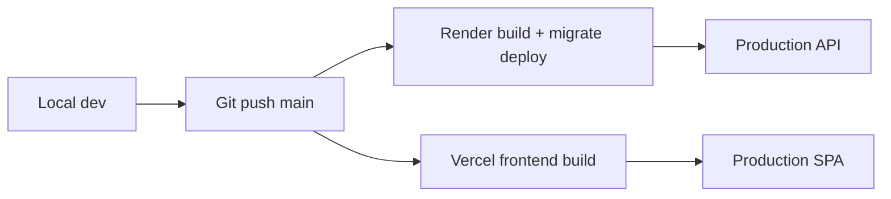

# Release Review

> **Phase:** Long-Term Platform Evolution — Review 4/4  
> **Scope:** Deploy pipeline, environments, rollback, feature rollout, release discipline

---

## 1. Executive summary

| Capability | Status | Grade |
|------------|--------|-------|
| Production deploy | Render + Vercel | **B** |
| Pre-deploy checklist | `release-checklist.md` | **B+** |
| Env validation | `envValidation.ts` fail-fast | **A-** |
| Health probes | `/health`, `/ready` | **B+** |
| Migrations | Auto via `productionStart.mjs` | **B** |
| Staging environment | **Missing** | **F** |
| Beta channel | Ad hoc `featureFlags` | **D** |
| Feature flags (platform) | Per-business JSON only | **D** |
| Rollback runbook | Documented, manual | **C** |
| Automated smoke tests | Manual checklist | **D** |
| Observability post-deploy | Logs only | **D** |

**Verdict:** Safe enough for controlled beta; **not** mature for high-frequency releases or large merchant cohort rollouts.

---

## 2. Current release pipeline



| Step | Tool | Gap |
|------|------|-----|
| Build | `npm run build` | No build artifact promotion |
| Migrate | `prisma migrate deploy` on start | Runs on every deploy — OK |
| Frontend env | `VITE_API_URL` at build time | Must rebuild SPA for API URL change |
| Health gate | Render `/health` | Does not check DB on liveness |
| Smoke test | Manual 15 min | Not automated |

---

## 3. Environment matrix (target)

| Environment | API host | SPA host | DB | Purpose |
|-------------|----------|----------|-----|---------|
| **Local** | localhost:3000 | localhost:5173 | Local/docker PG | Dev |
| **Staging** | Render preview service | Vercel preview | Staging PG clone | Pre-prod validation |
| **Production** | Render prod | Vercel prod | Render PG prod | Live merchants |

### Staging setup (Phase 1 — recommended)

1. Render: duplicate service `miniapp-store-staging` + separate DB  
2. Vercel: Preview deployments on PR + `staging` branch alias  
3. Env: `NODE_ENV=production` but separate secrets; `SKIP_*` forbidden same as prod  
4. Bot: separate Telegram bot for staging Mini App  
5. Gate: smoke checklist required before prod merge  

**Cost:** ~2× Render web + DB — acceptable for stability ROI.

---

## 4. Feature flags & rollout

### 4.1 Current

| Mechanism | Scope | Limitation |
|-----------|-------|------------|
| `Business.featureFlags` JSON | Per merchant | No schema, no registry |
| Env vars | Global | Requires redeploy |
| `betaCohort` (runbook) | Manual | Operator sets in DB |

Storefront flags resolved in `src/storefront/featureFlags.ts` — **good pattern**, needs platform-level equivalent.

### 4.2 Target registry

```typescript
// src/shared/platformFeatureFlags.ts (Phase 1)
export const PLATFORM_FLAGS = {
  discover_v2: { default: false, description: "Discover sections UI" },
  unified_merchant_auth: { default: false, description: "initData on /merchant/*" },
  analytics_rollup: { default: false, description: "Read rollups not live SQL" },
} as const;
```

**Rollout stages:**

1. `dev` — local on  
2. `staging` — on  
3. `beta` — `Business.featureFlags.betaCohort` or `%` hash  
4. `ga` — default true  
5. `deprecated` — default false, warn in logs  
6. `removed` — code deleted next major  

---

## 5. Migration strategy

| Rule | Rationale |
|------|-----------|
| Every schema change = Prisma migration file | Reproducible deploys |
| Backward-compatible deploys | Expand → migrate data → contract (2 deploys if needed) |
| No manual SQL on prod without migration file | Audit trail |
| Test migrate on staging first | Catch lock/timeout issues |
| Destructive migrations require backup + runbook | Rollback may need DB restore |

**Expand-contract example:**

1. Deploy A: add nullable column  
2. Backfill job  
3. Deploy B: make NOT NULL, remove old column  

---

## 6. Rollback strategy

### 6.1 Current (documented)

From `release-checklist.md`:

1. Revert git commit on Render + Vercel  
2. If irreversible migration → DB backup restore  
3. Verify `/health` + smoke #1  

### 6.2 Gaps

| Gap | Mitigation |
|-----|------------|
| No one-click rollback | Render manual redeploy previous commit — document commit SHA |
| Frontend/API version skew | Deploy API first, then SPA (or feature flags for breaking API) |
| Migration forward-only | Prefer additive migrations |
| No deploy tags | Tag releases `v2026.05.21` in git |

### 6.3 Rollback decision tree

```
Deploy caused 5xx spike?
├── Yes → Rollback API to previous Render deploy (< 5 min)
│         If migration broke schema → restore DB backup
└── No but feature bug?
          → Disable feature flag
          → Hotfix forward if flag insufficient
```

---

## 7. Deprecation strategy

| Asset type | Notice period | Channel |
|------------|---------------|---------|
| API route | 90 days | Response header `Deprecation: true` |
| UI screen | 30 days | In-app banner |
| Env var | Next major | `envValidation` warning |
| DB column | 2 deploys | Expand-contract |

**Log deprecated usage** at warn level with route name — count before removal.

---

## 8. Release cadence (recommended)

| Type | Frequency | Contents |
|------|-----------|----------|
| **Patch** | As needed | Hotfix, security |
| **Minor** | Bi-weekly | Features behind flags, polish |
| **Major** | Quarterly | Breaking changes, deprecations removed |

**Freeze:** No prod deploy Friday after 16:00 Bishkek unless hotfix.

---

## 9. Pre-release gate checklist (enhanced)

Extend existing checklist:

### Automated (Phase 1 CI)

- [ ] `npm run check`  
- [ ] `prisma validate`  
- [ ] No pending migration drift  

### Staging (Phase 1)

- [ ] Full smoke on staging  
- [ ] Migration applied clean  
- [ ] Webhook test with staging bot  

### Production

- [ ] Existing `release-checklist.md` items  
- [ ] Feature flags default-safe for GA  
- [ ] Rollback SHA noted in deploy message  
- [ ] 24h log watch assigned  

---

## 10. Observability for releases

| Signal | Tool | Phase |
|--------|------|-------|
| 5xx rate | Render metrics | 1 |
| Error tracking | Sentry | 1 |
| Deploy marker | Sentry release / log line | 1 |
| Funnel drop | Admin funnel API | Live |
| Uptime | Better Stack / UptimeRobot → `/health` | 1 |

---

## 11. Release review findings

| ID | Severity | Finding | Action |
|----|----------|---------|--------|
| REL-01 | P0 | No staging | Provision staging stack |
| REL-02 | P0 | No automated smoke | Script critical paths |
| REL-03 | P1 | Feature flag ad hoc | Platform flag registry |
| REL-04 | P1 | No Sentry | Add DSN both sides |
| REL-05 | P1 | TELEGRAM_INIT_DEBUG=1 in render.yaml default | Remove for prod template |
| REL-06 | P2 | No release git tags | Tag on prod deploy |
| REL-07 | P2 | Manual rollback only | Document + practice quarterly |

---

## Related docs

- [Release Checklist](../release-checklist.md)
- [Release Preparation Validation](../release-preparation-validation.md)
- [Product Governance](../product-governance.md)
- [Operator Runbook](../guides/operator-runbook.md)
