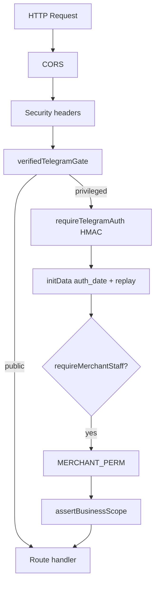

# ARCHA Phase 18 — Security Inventory

> **Authoritative inventory** for production hardening. Supersedes operational details in
> [`docs/platform-maturity-hardening-audit.md`](../platform-maturity-hardening-audit.md) §1 (historical SEC IDs retained there).

**Date:** Phase 18 implementation  
**Stack:** Node/Express API + Prisma PostgreSQL + Telegram Mini App + Vercel/Render (VPS-ready)

---

## 1. Endpoint surfaces

| Surface | Auth | Tenant scope | Rate limit | Validation |
|---------|------|--------------|------------|------------|
| Public catalog / storefront | None | `resolveCatalogBusinessId` | Partial (`apiLimiter` on `/api/*` only) | Zod on some payloads |
| Customer orders / support | Verified `x-telegram-init-data` | Hint + product-derived tenant | `ordersLimiter`, abuse guards | Checkout unchanged |
| Merchant admin | initData + `requireMerchantStaff` | `merchant.businessId` | `merchantMutationLimiter` | Per-route |
| Platform `/api/platform/*` | initData | Ownership / staff checks | `strictLimiter` | Existing |
| Operator / admin | initData + session + reauth | Aggregate only | `strictLimiter` | Existing |
| Webhooks | Secret / HMAC / RSA | Per-route token | `webhooksLimiter` / custom RPS | Shape validation |

**Route modules:** [`src/server/index.ts`](../../src/server/index.ts), `supportRoutes.ts`, `staffRoutes.ts`, `diningTableRoutes.ts`, `tableReservationRoutes.ts`, `waitlistRoutes.ts`, `venueOperationsRoutes.ts`, Finik mounts.

---

## 2. Authentication layers

| Layer | Implementation | Production |
|-------|----------------|------------|
| Telegram initData | [`requireTelegramAuth.ts`](../../src/middleware/requireTelegramAuth.ts) | HMAC + `auth_date` freshness (Phase 18) |
| Verified identity | [`verifiedTelegramAuth.ts`](../../src/middleware/verifiedTelegramAuth.ts) | `platformTelegramId` only; no `x-telegram-id` |
| Operator session | [`platformOperatorAuth.ts`](../../src/server/platformOperatorAuth.ts) | bcrypt + opaque token + reauth window |
| Merchant RBAC | [`merchantPermissions.ts`](../../src/server/merchantPermissions.ts) | `MERCHANT_PERM` + role defaults |

**No JWT** — Telegram-first unchanged.

---

## 3. Attack surface map

### Addressed in Phase 18

| ID | Issue | Mitigation |
|----|-------|------------|
| P18-01 | No server `auth_date` check | `telegramInitDataPolicy.ts` |
| P18-02 | initData replay | Optional in-memory replay guard |
| P18-03 | No HTTP security headers | `securityHeaders.ts` |
| P18-04 | Open CORS | Env allowlist `CORS_ALLOWED_ORIGINS` (default `*`) |
| P18-05 | Rate limit proxy mismatch | `trustProxy` when app trusts proxy |
| P18-06 | Bot token prefix in logs | Redacted logging |
| P18-07 | Loose support/receipt uploads | `validateImageFile` + `mimeSniff` |
| P18-08 | No cross-tenant contract tests | `tenantIsolation.test.ts` |
| P18-09 | `/merchant/notifications` any staff | Requires `ordersManage` or `analyticsView` |
| P18-10 | `whoami` exposes raw telegramId in prod | Redacted in production |

### Remaining / documented

| ID | Issue | Notes |
|----|-------|-------|
| P18-R01 | Dual route surface (`/orders` vs `/api/*`) | Legacy + API coexist; mutation limiter on privileged paths |
| P18-R02 | In-memory replay/rate (Finik, Telegram) | Single-instance OK; Redis for multi-instance later |
| P18-R03 | DB bot-token scan (1000 rows) | Default on; disable via `WEBAPP_VALIDATE_INITDATA_SCAN_STORE_BOTS=0` |
| P18-R04 | Platform operator store-settings bypass | Intentional; audit log `operator_store_access` |
| P18-R05 | Public analytics ingest | By design; rate limited |

---

## 4. Tenant isolation model

1. Client hint: `?businessId` / `?shop` / `x-business-id` / body
2. Verified Telegram identity via initData
3. `requireMerchantStaff(businessId, telegramId)` → `BusinessStaff` row required
4. Service queries use `where: { businessId }` from authenticated context
5. Resource fetch: `assertBusinessScope` on id-only lookups (Phase 18)

**Consolidated hint parser:** [`resolveTenantHint.ts`](../../src/server/resolveTenantHint.ts)

---

## 5. Secrets inventory

| Secret | Storage | Validated in prod |
|--------|---------|-------------------|
| `DATABASE_URL` | ENV | Required |
| `BOT_TOKEN_SECRET_KEY` | ENV | Required |
| `TELEGRAM_WEBHOOK_SECRET` | ENV | Required |
| `OPERATOR_PASSWORD_HASH` | ENV | Warn if missing |
| Finik PEM keys | ENV | `validateFinikOfficialEnvKeys` |
| Cloudinary | ENV | Warn if uploads enabled |
| Bot tokens | DB encrypted | `botTokenCrypto.ts` |

---

## 6. Payload limits

| Route class | Default limit | Env override |
|-------------|---------------|--------------|
| General API JSON | 10kb | `API_JSON_BODY_LIMIT` |
| Webhooks / Finik | 512kb | `API_JSON_BODY_LIMIT_LARGE` |

---

## 7. Webhook endpoints

| Path | Verification |
|------|--------------|
| `/telegram-webhook/*` | `TELEGRAM_WEBHOOK_SECRET` + RPS/IP |
| `/webhook/:token` | Same gate + route token |
| `/finik/webhook/:businessId` | HMAC/RSA + replay guard |
| `/api/payments/finik-webhook` | Per-merchant HMAC |
| `/api/platform/subscription-finik-webhook` | Platform RSA |

---

## 8. Debug / dangerous endpoints

| Endpoint | Risk | Protection |
|----------|------|------------|
| `GET /health`, `GET /ready` | Info disclosure | Minimal payload |
| `GET /api/platform/admin/whoami` | ID enumeration | initData required; prod redaction |
| `POST /check-admin` | Staff probe | Verified initData + strict rate limit |
| `POST /api/telemetry/client-error` | Spam | `apiLimiter` + telemetry limiter |
| `WEBHOOK_DEBUG=1` | PII in logs | Forbidden in production |

---

## 9. Phase 18 checklist reference

See [`phase-18-final-report.md`](phase-18-final-report.md) for implementation status per sub-phase 18.1–18.12.
